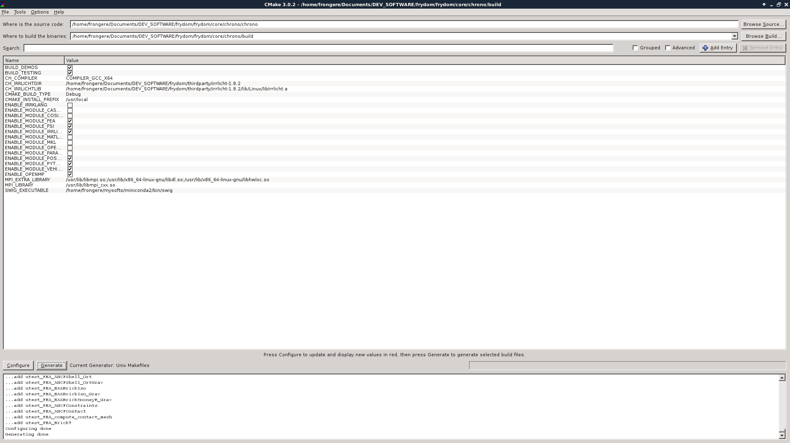

Clone the FRyDoM repository
===========================

The FRyDoM project is currently hosted on githost at git@d-ice.githost.io:frydom/frydom.git

To clone the repository, just do::

    >$ git clone git@d-ice.githost.io:frydom/frydom.git

Update the Chrono submodule
===========================

Since june 2017, Chrono is the multibody core of FRyDoM. It order to make FRyDoM rely on Chrono codebase,
it has been chosen to make Chrono available as a git submodule of FRyDoM. The Chrono code is currently
located in the ``<FRyDoM_repo>/frydom/core/chrono/chrono`` directory.

Right after the clone of the FRyDoM repo, you may observe that there are no source code inside this directory.
This is indeed normal and you must trigger two more commands to populate it (at the root of the FRyDoM repo)::

    >$ git submodule init
    >$ git submodule update

This will clone the Chrono repo into its directory.
Note that the repo that is used is not directly the official Chrono repo but a GitHub fork that allows us to
edit changes (as less as possible !!) into the Chrono code and later send pull requests to the Chrono's developpers.

Building Thirdparty software
============================

    Building Irrlicht
    -----------------

Using Irrlicht as a graphics engine for Chrono needs to make irrlicht lib available. As Irrlicht is not under any
version control system, it has been chosen to integrate it directly into the FRyDoM repo under the ``thirdparty/irrlicht-1.8.2``
directory. You need to compile irrlicht in order to be able to compile Chrono with the Irrlicht support::

    >$ cd thirdparty/irrlicht-1.8.2/source/Irrlicht
    >$ make

This will create a static in ``thirdparty/irrlicht-1.8.2/lib/<YOUR_ARCHITECTURE_FOLDER>``. By eg., under Linux, a libIrrlicht.a
file will be created.

Note that some modification have been made to the initial Irrlicht Makefile to make it work with Chrono (Adding -fPIC to the
compilation flags as Chrono was complaining about it although there is no mention of the issue in the Chrono documentation).

    Building Chrono
    ---------------

To build Chrono as a dynamic library, you need first to configure the project using cmake::

    >$ cd frydom/core/chrono/chrono
    >$ cmake-gui

This will open a cmake GUI allowing to tune the Chrono install. Please adapt the following configuration to your paths:

You will have to check the same checkboxes and recursively click on the Configure button, especially when you check the
``ENABLE_MODULE_IRRLICHT`` which will create you two new variables ``CH_IRRLICHTDIR`` and ``CH_IRRLICHTLIB`` that have to
be set using the preceding irrlicht build.

Don't forget to set the ``CMAKE_BUILD_TYPE`` to ``Debug`` if you want to be able to step into the shared libraries when using a
debugger while developping into FRyDoM.

When there are no error anymore in the *Configure* step, you can click on Generate. Please note that FRyDoM is configured
so that it should find the chrono build into ``frydom/core/chrono/build`` directory. That is, during the configuration, you must
tell cmake that the build will be there (by properly configuring the *Where to build the binaries* field).

Once the build chain has been generated by cmake, you can do::

    >$ cd ../build
    >$ make

If everything goes well, it will build dynamic libs for every Chrono module that have been selected during the cmake configuration.
These libs are now present in the ``frydom/core/chrono/build/lib64`` directory where you can find the most important one: libChronoEngine.so.

Building FRyDoM
===============

Just like Chrono, FRyDoM uses cmake for its build management. At the root of the FRyDoM repository, you just have to do::

    >$ cmake CMakeLists.txt
    >$ make

