.. _bench_cables:

Comparisons between Catenary and Dynamic cables
===============================================

This benchmark is dedicated to comparisons between the two cable models in FRyDoM : :any:`quasi-static catenary
line <analytic_catenary>` and :any:`dynamic cable <dynamic_cable>`.

Two benchmarks are reported here : the first is for a taut line case and the second a slack line case. The starting and
ending nodes are fixed in the world reference frame, at respectively :math:`\mathbf{n1} = (-10,0,-10)` and
:math:`\mathbf{n2} = (10,0,10)`, with a distance :math:`D` between them.

The unstretched length varies from :math:`0.85 D` for the taut lines, to :math:`1.5 D` for the slack lines.

In both cases, we compare the stretched length given by the two models, as well as the tensions at the starting and ending nodes of the lines.

The relative error on the stretched length, :math:`L_s` is computed by

.. math::
    \epsilon_{Length} = 100 \dfrac{L_s(Dynamic) - L_s(Catenary)}{L_s(Catenary)}

The relative error for the tension in the line, :math:`\mathbf{t}`, is integrated on the line

.. math::
    \epsilon_{Tension} = 100 \sum_{i = 0}^{N_{elements}} \dfrac{ | \mathbf{t}_{Dynamic}(s_i) - \mathbf{t}_{Catenary}(s_i) | }{N_{elements} |\mathbf{t}_{Catenary}(s_i)|}

The lines properties are given in the following table :

========================= =======================
Parameters                Values
========================= =======================
Radius                    0.05 m
Linear density            616.538 kg/m
Section area              0.007854 m²
Young modulus             636620000 Pa
Rayleigh damping          0
Number of elements        50
========================= =======================

Taut case
---------

The following figures show the stabilization of the stretched length and tensions of the dynamic cable to the values
estimated by the quasi-static catenary model.

Relative errors for the stretched length and tension in the lines are given in the following table

========================= =======================
Relative Errors            Values
========================= =======================
Stretched length          6.15955e-05 %
Tension in the lines      0.1686 %
========================= =======================

.. _fig_taut_Irr:
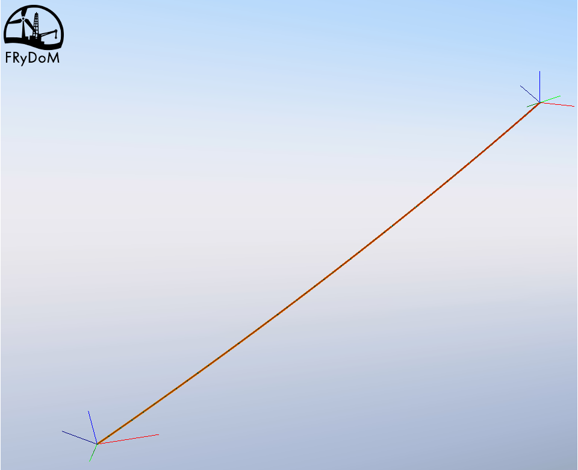

    Line profiles given by the dynamic and catenary models (superposed)

.. _fig_taut_length:
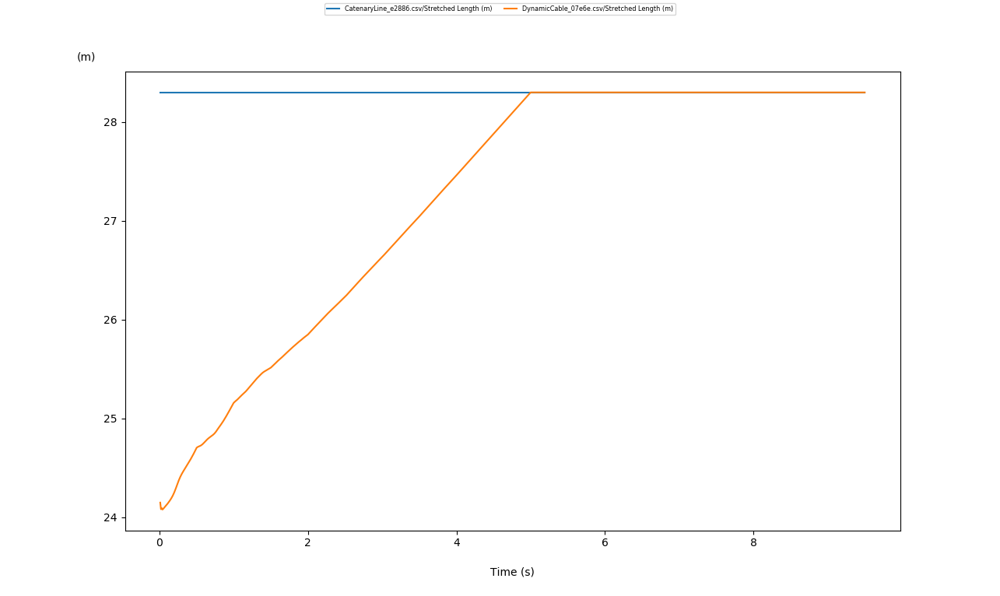

    Stretched length given by the dynamic (orange) and catenary (blue) models

.. _fig_taut_Tension_starting_X:
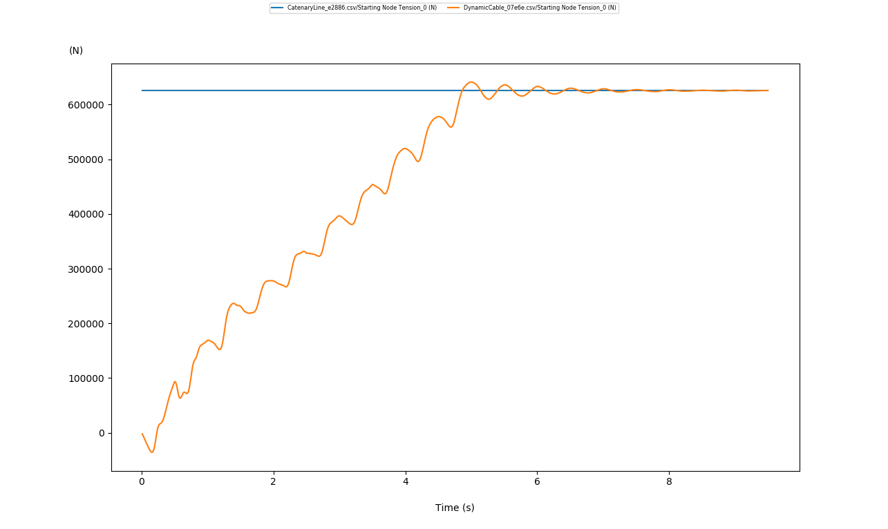

    Horizontal tension in the starting node given by the dynamic (orange) and catenary (blue) models

.. _fig_taut_Tension_starting_Z:
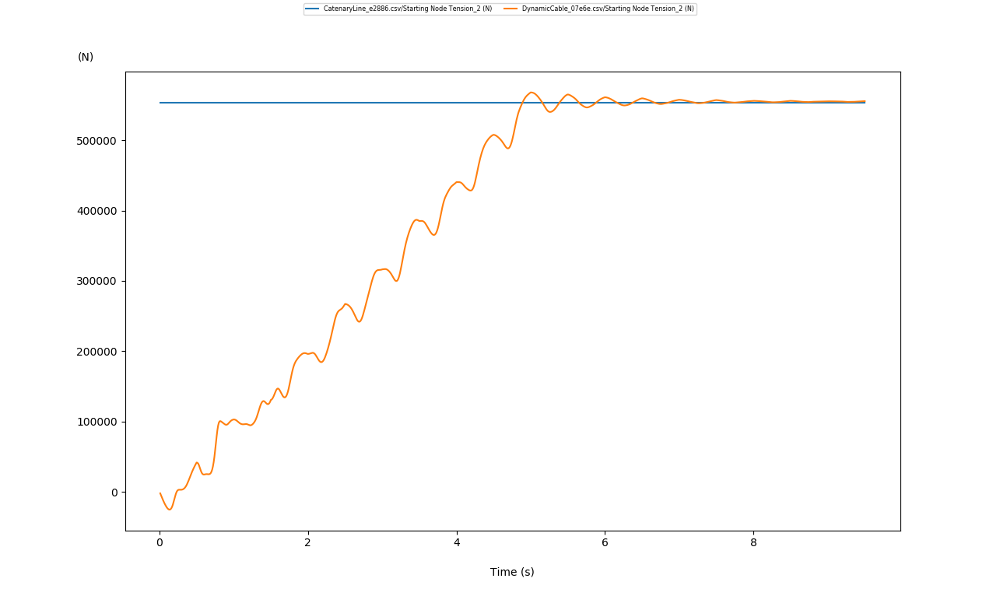

    Vertical tension in the starting node given by the dynamic (orange) and catenary (blue) models

.. _fig_taut_Tension_ending_X:
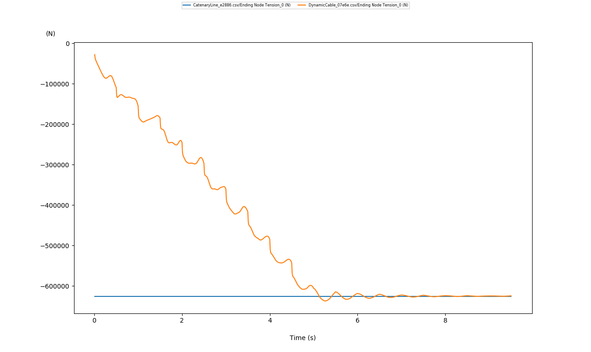

    Horizontal tension in the ending node given by the dynamic (orange) and catenary (blue) models

.. _fig_taut_Tension_ending_Z:
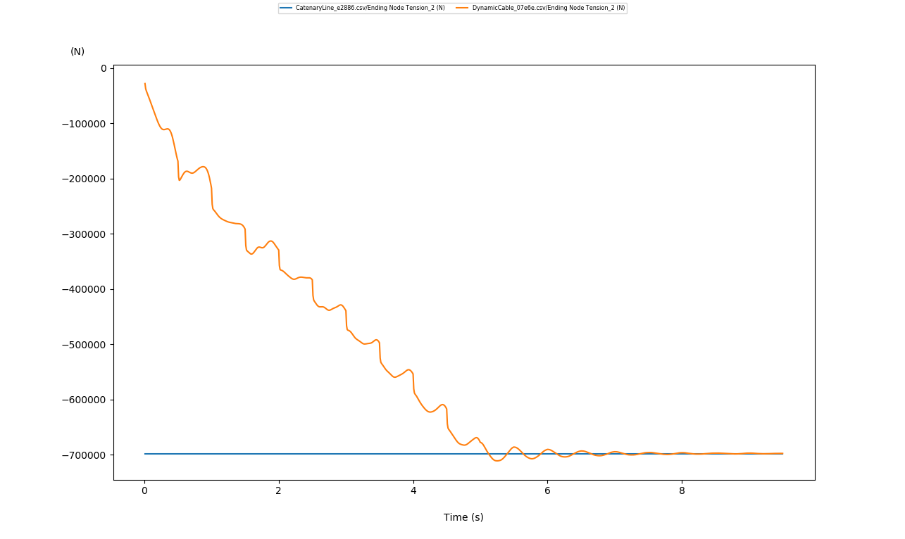

    Vertical tension in the ending node given by the dynamic (orange) and catenary (blue) models

Slack case
----------

The following figures show the stabilization of the stretched length and tensions of the dynamic cable to the values
estimated by the quasi-static catenary model.

Relative errors for the stretched length and tension in the lines are given in the following table. Discrepancies on the
tension results given by the two models are larger than in the taut case, since bending is larger in the slack case.

========================= =======================
Relative Errors            Values
========================= =======================
Stretched length          0.00138824 %
Tension in the lines      4.13197 %
========================= =======================

.. _fig_slack_Irr:
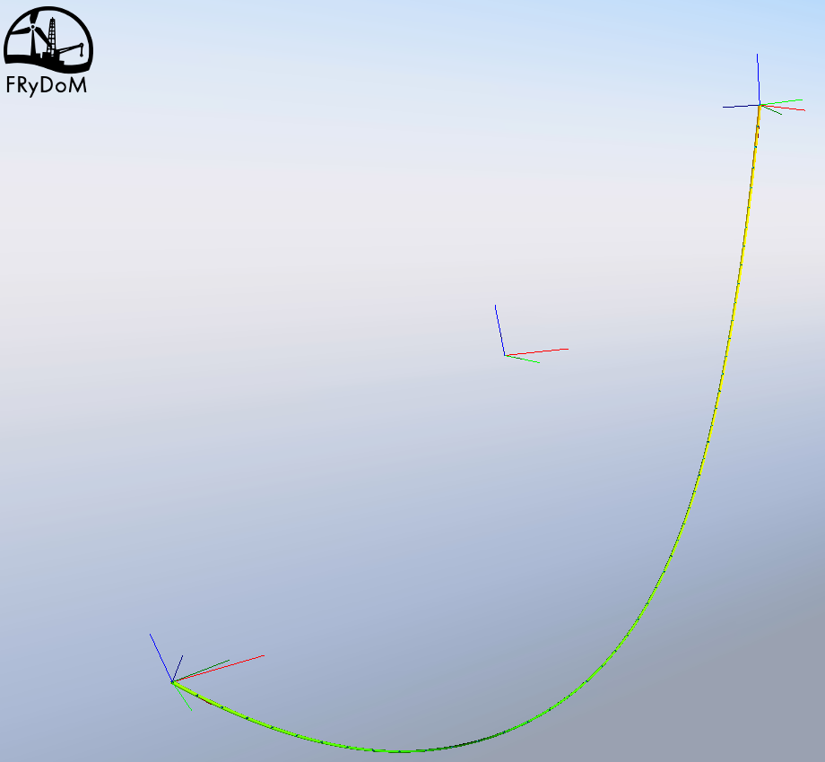

    Line profiles given by the dynamic and catenary models (superposed)

.. _fig_slack_length:
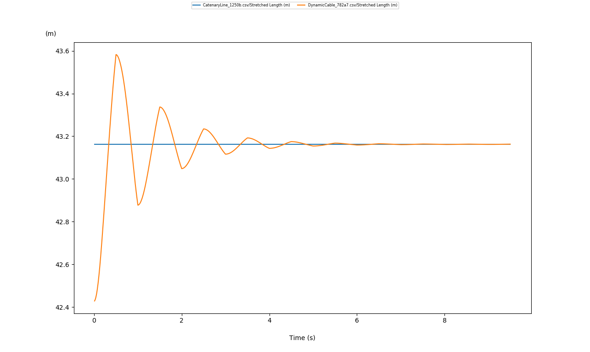

    Stretched length given by the dynamic (orange) and catenary (blue) models

.. _fig_slack_Tension_starting_X:
.. figure:: _static/bench_Cables/Slack/Tension_Starting_X.png
    :align: center
    :alt: Slack Tension_Starting_X

    Horizontal tension in the starting node given by the dynamic (orange) and catenary (blue) models

.. _fig_slack_Tension_starting_Z:
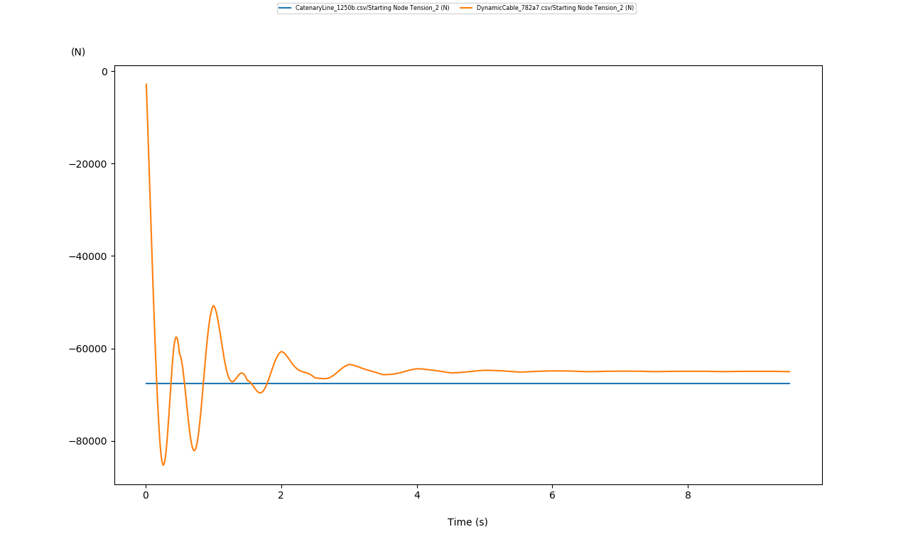

    Vertical tension in the starting node given by the dynamic (orange) and catenary (blue) models

.. _fig_slack_Tension_ending_X:
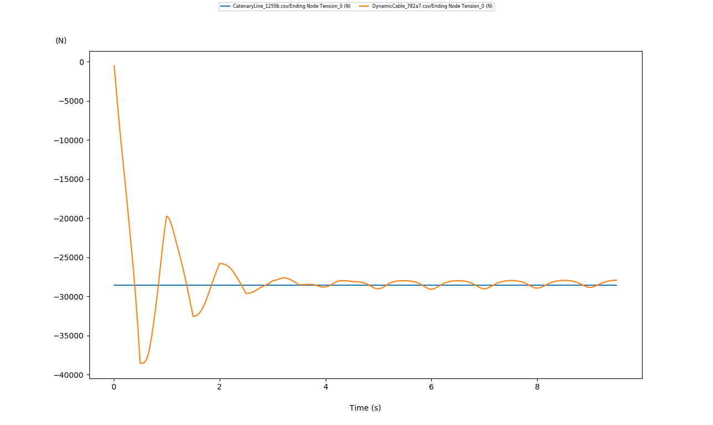

    Horizontal tension in the ending node given by the dynamic (orange) and catenary (blue) models

.. _fig_slack_Tension_ending_Z:
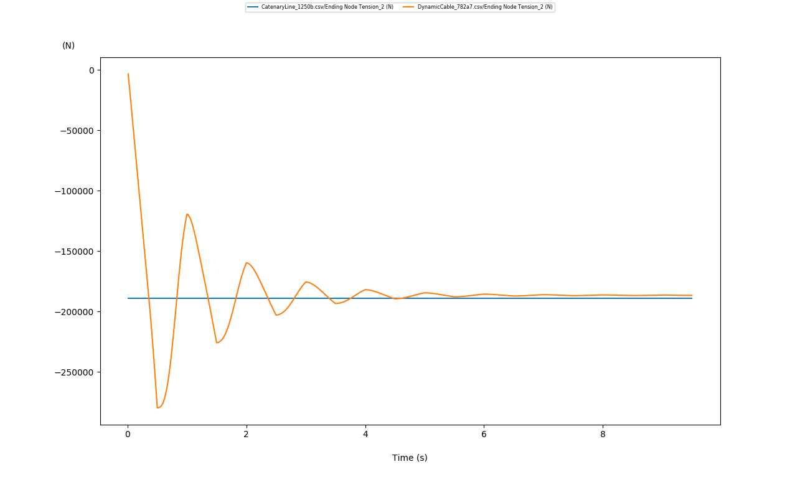

    Vertical tension in the ending node given by the dynamic (orange) and catenary (blue) models