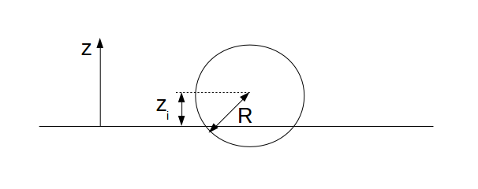
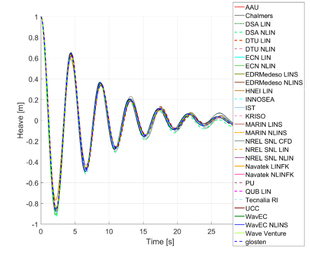
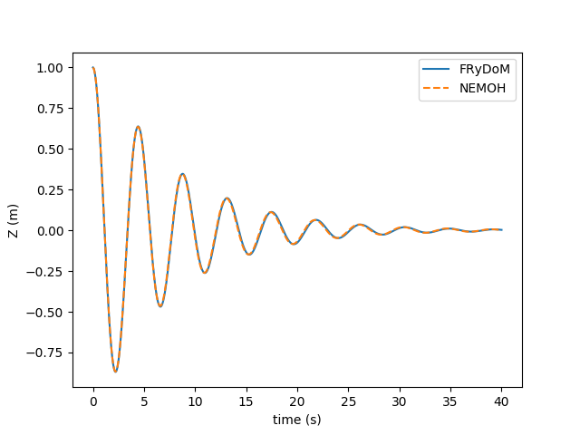
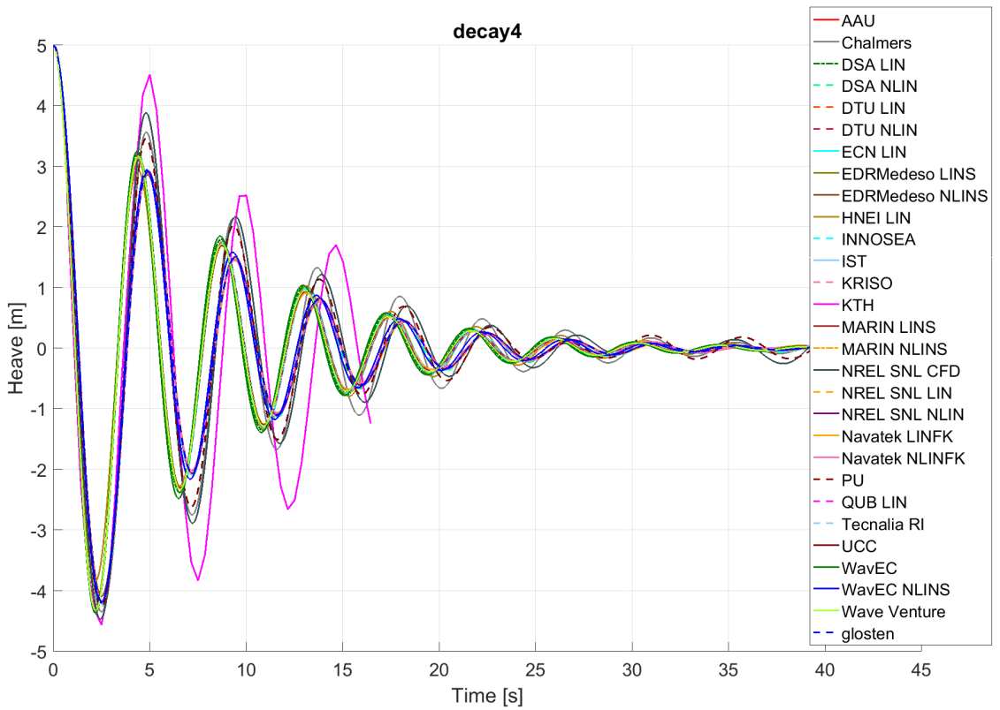
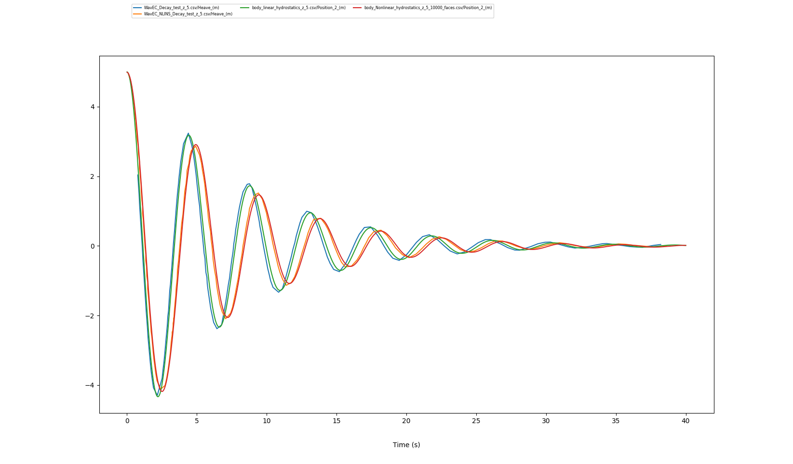

.. heaving_sphere_decay_test:

Heaving sphere in free-decay test
~~~~~~~~~~~~~~~~~~~~~~~~~~~~~~~~~

This benchmark corresponds to the simulation of a sphere in free-decay test. This simulation is presented by the International Energy Agency (IEA) Offshore Energy System (OES) Task 10 [OES10]_ as a benchmark case for model validation and verification regrouping 25 organizations. The description of this test case and the results obtained by FRyDoM are summarized in the following.

Description of the test case
----------------------------

The sphere considered in this simulation has a radius of :math:`5` \\(m\\) and a total mass of :math:`2,618 .10^5` \\(kg\\). At equilibrium, the center of the sphere is located on the mean water level and its center of gravity is located :math:`2` \\(m\\) below the water line. The main properties of the sphere are presented in the next table.

========================= ==================================
Parameters                Values
========================= ==================================
Radius                    :math:`5` \\(m\\)
Initial sphere location   (:math:`0`, :math:`0`, :math:`0`)
Center of gravity         (:math:`0`, :math:`0`, :math:`-2`)
Mass	                  :math:`261.8\times10^3` \\(kg\\)
Ixx                       :math:`1.690\times10^6` \\(kg.m^2\\) 
Iyy                       :math:`1.690\times10^6` \\(kg.m^2\\)
Izz                       :math:`2.606\times10^6` \\(kg.m^2\\)
Water detph               Inf
Water density             :math:`1000` \\(kg/m^3\\)
K33                       :math:`7.695\times10^5` \\(N/m\\)
K44                       :math:`5.126\times10^6` \\(N.m\\)
K55                       :math:`5.126\times10^6` \\(N.m\\)
========================= ==================================

At initial time, the sphere is placed at a distance of :math:`1` \\(m\\), :math:`3` \\(m\\) or :math:`5` \\(m\\) above the mean water level and dropped without velocity (:numref:`fig_decay_description`).

.. _fig_decay_description:

    Decription of the heaving sphere test cases

Results for a decay test of :math:`1` \\(m\\)
---------------------------------------------

The numerical results of [OES10]_ are displayed in :numref:`fig_deacy_1m_OES`. This figure shows the vertical position of the center of sphere. Various models with different levels of nonlinearities were used, from the linear potential flow theory based numerical tools to CFD solvers. With an initial position of :math:`1` \\(m\\) for the decay test, all these models match. Consequently, nonlinearities are not important in this case. 

.. _fig_deacy_1m_OES:

    
    Time series for the heave decay test of a sphere with :math:`1.0` \\(m\\) initial displacement from different numerical models

The numerical results of FRyDoM are compared to the results coming from the linear model of Ecole Centrale de Nantes (ECN LIN) based on Nemoh, the frequency-domain potential flow theory based solver [Nemoh]_. The comparison is presented in :numref:`fig_decay_result`. A very good agreement between the two models is observed.

.. _fig_decay_result:

    Free-decay motion of the sphere for the :math:`1.0` \\(m\\) initial displacement and comparison with ECN LIN

Results for a decay test of :math:`5` \\(m\\)
---------------------------------------------

The decay test with an initial position of the sphere of :math:`5` \\(m\\) is now considered. Numerical results of [OES10]_ are presented in :numref:`fig_decay_1m_OES`. Three groups of models may be distinguished:

- linear models without nonlinearities: WavEC, Wave Venture, ECN LIN, MARIN LINS, etc.;
- weakly nonlinear models which add some nonlinear such as nonlinear hydrostatics, nonlinear Froude-Krylov models: WavEC NLINS, NREL SNL NLIN, etc.;
- fully nonlinear models based on nonlinear potential flow solvers or CFD sovlers: NREL SNLCFD, PU, etc. 

The use of a weakly nonlinear approach involves a modification of the period of the decay test compared to the linear models. Results from the fully nonlinear models increase the amplitude of the sphere compared to the results of the weakly nonlinear solvers.

.. _fig_decay_1m_OES:

    Time series for the heave decay test of a sphere with :math:`5.0` \\(m\\) initial displacement from different numerical models

The numerical results of FRyDOM obtained with both a fully linear approach and a nonlinear hydrostatics and Froude-Krylov approach are presented in :numref:`fig_decay_result_5m`. These results are compared with the two models of WaveEC which are based on the same two models of FRyDoM. A very good agreement is obtained with the two different approaximations.

.. _fig_decay_result_5m:

    Free-decay motion of the sphere for the :math:`1.0` \\(m\\) initial displacement and comparison with ECN LIN. Linear models: WavEC in blue, FRyDoM in green, weakly nonlinear models: WavEC in orange, FRyDoM in red.

References
----------

.. [OES10] F. Wendt, Y-H Yu, K. Ruehl, T. Bunnik, I. Touzon, B. W. Nam, J. S. Kim, K-H Kim, C. E. Janson, K-R. Jakobsen, S. Crowley, L. Vega, K. Rajagopalan, T. Mathai, D. Greaves, E. Ransley, P. Lamont-Kane, W. Sheng, R. Costello, B. Kennedy, S. Thomas, P. Heras, H. Bingham, A. Kurniawan, M. M. Kramer, D. Ogden, S. Girardin, A. Babarit, P.-Y. Wuillaume, D. Steinke, A. Roy, S. Betty, P. Shofield, J. Jansson and J. Hoffman, "International Energy Agency Ocean Energy Systems Task 10 Wave Energy Converter Modeling Verification and Validation", European Wave and Tidal Energy Conference, Cork, Ireland, 2017

.. [Nemoh] A. Babarit and G. Delhommeau, "Theoretical and numerical aspects of the open source BEM solver NEMOH", in Proc. of the 11th European Wave and Tidal Energy Conference", Nantes, France, 2015.

