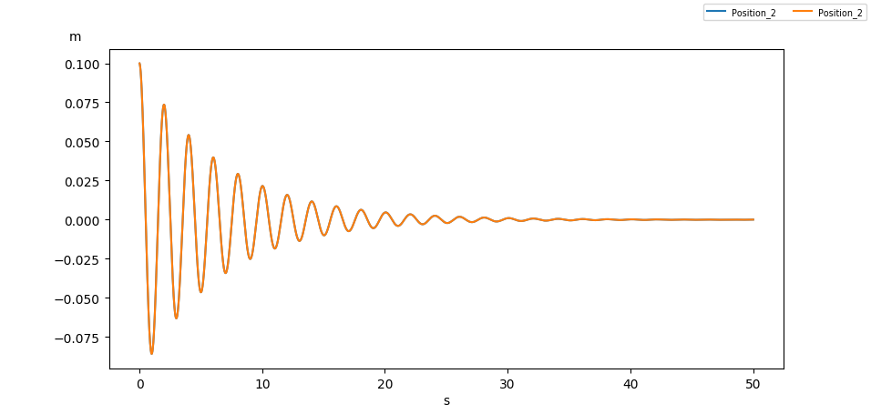
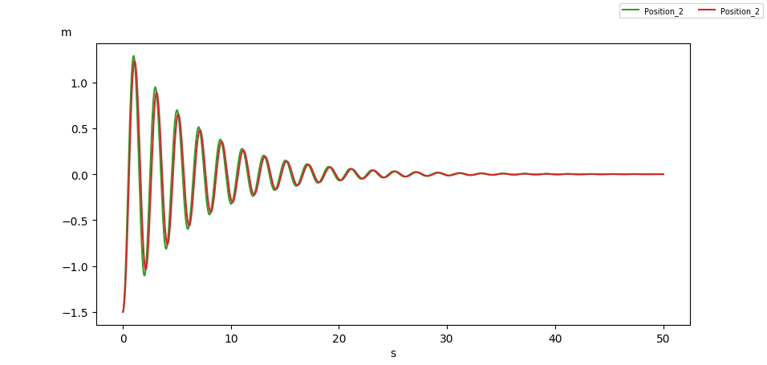

.. hydrostatics_decay:

Decay tests on a box
~~~~~~~~~~~~~~~~~~~~

We simulate in time domain the hydrostatic equilibrium of a box in heave and pitch, comparing the solution given by the
linear and nonlinear approximations.

We consider a box with the following dimensions :math:`(L,B,H) = (8,4,2)m`, with a center of gravity located at the center of the box.
Its mass is taken as

.. math::
    mass = \dfrac{1}{2} \rho_{water}\times  V_{box} =  \dfrac{1}{2} \rho_{water}\times  L \times B \times H

An artificial linear damping force is introduced, to make for the hydrodynamic radiation damping. (see :any:`other_damping`).
The diagonal coefficients are taken at :math:`1E4` for the translation and rotation degrees of freedom.

.. _fig_heave_L:

    Decay test in heave, in small amplitude motions : blue = linear approximation, orange = nonlinear approximation

.. _fig_heave_NL:

    Decay test in heave, in large amplitude motions : green = linear approximation, red = nonlinear approximation

.. _fig_pitch_L:
.. figure:: _static/hydrostatic_decay/pitch.png
    :align: center
    :alt: decay test in pitch, in small amplitude motions

    Decay test in pitch, in small amplitude motions : violet = linear approximation, brown = nonlinear approximation

.. _fig_pitch_NL:
.. figure:: _static/hydrostatic_decay/pitchNL.png
    :align: center
    :alt: decay test in pitch, in large amplitude motions

    Decay test in pitch, in large amplitude motions : pink = linear approximation, grey = nonlinear approximation