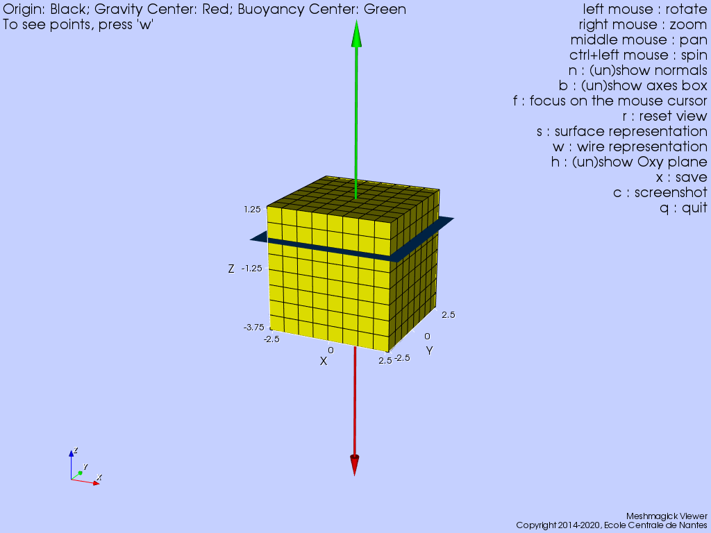
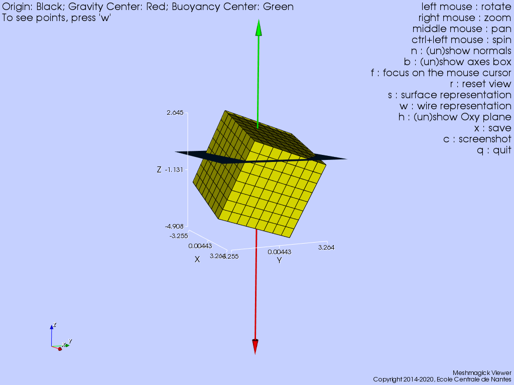
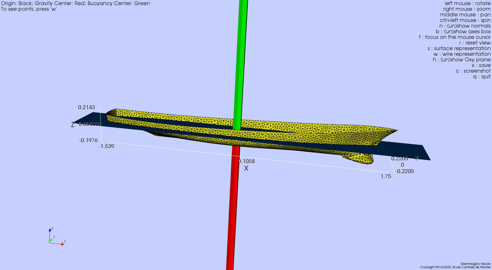
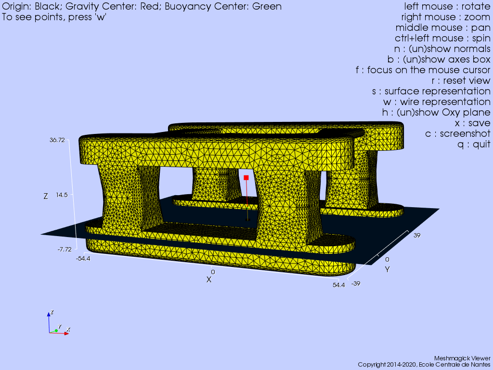
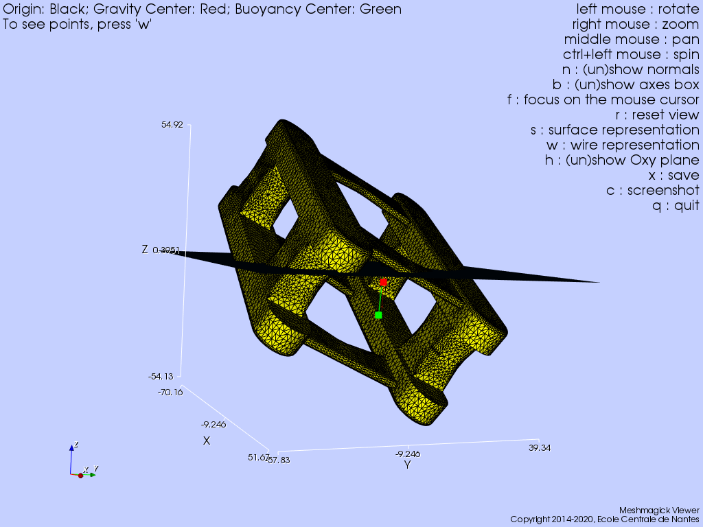

.. hydrostatics_equilibrium:

Hydrostatic equilibrium solving
~~~~~~~~~~~~~~~~~~~~~~~~~~~~~~~

..
    TODO: write the theory doc of the hydrodyanmic solving : Newton-Raphson, Stiffness matrix, relaxation, equation to solve, etc.

The hydrostatic equilibrium of several bodies in different configurations is computed using the Newton-Raphson solver,
and compared to Meshmagick.

Box
+++

Initial conditions
__________________

We first consider a simple square box, which dimensions are equals to 5 meters and weights 95.906 tons, and its COG is located
at the geometric center of the box, which is also the position of the body reference frame.

.. _fig_box_initial:

    box equilibrium position for a COG located at :math:`(0., 0., 0.)` meters.

The hydrostatic parameters given by Meshmagick and FRyDoM solvers are :

=============================== =============================================== ========================================
Parameters                      Meshmagick                                      FRyDoM
=============================== =============================================== ========================================
Waterplane area                 :math:`25` \\(m\\)                              :math:`25` \\(m\\)
Waterplane center               (:math:`0`, :math:`0`, :math:`0`)\\(m\\)        (:math:`0`, :math:`0`, :math:`0`)\\(m\\)
Hull wet surface                :math:`100`\\(m^2\\)                            :math:`100`\\(m^2\\)
Volume displacement	            :math:`93.75` \\(m^3\\)                         :math:`93.75` \\(m^3\\)
Mass displacement               :math:`95.906` \\(tons\\)                       :math:`95.906` \\(tons\\)
Buoyancy center                 (:math:`0`, :math:`0`, :math:`-1.875`)\\(m\\)   (:math:`0`, :math:`0`, :math:`-1.875`)\\(m\\)
Center of gravity               (:math:`0`, :math:`0`, :math:`-1.250`)\\(m\\)   (:math:`0`, :math:`0`, :math:`-1.250`)\\(m\\)
Draught                         :math:`3.75` \\(m\\)                            :math:`3.75` \\(m\\)
Transversal metacentric radius  :math:`0.556` \\(m\\)                           :math:`0.556` \\(m\\)
Transversal metacentric height  :math:`-0.069` \\(m\\)                          :math:`-0.069` \\(m\\)
Longitudinal metacentric radius :math:`0.556` \\(m\\)                           :math:`0.556` \\(m\\)
Longitudinal metacentric height :math:`-0.069` \\(m\\)                          :math:`-0.069` \\(m\\)
K33                             :math:`2.5089 \times 10^5` \\(N/m\\)            :math:`2.5089 \times 10^5` \\(N/m\\)
K34                             :math:`0` \\(N\\)                               :math:`0` \\(N\\)
K35                             :math:`0` \\(N\\)                               :math:`0` \\(N\\)
K44                             :math:`-6.5337 \times 10^4` \\(N.m\\)           :math:`-6.5337 \times 10^4` \\(N.m\\)
K45                             :math:`0` \\(N.m\\)                             :math:`0` \\(N.m\\)
K55                             :math:`-6.5337 \times 10^4` \\(N.m\\)           :math:`-6.5337 \times 10^4` \\(N.m\\)
=============================== =============================================== ========================================

In FRyDoM, with the same inertia condition, but a different body reference frame (not on the geometric center but one of
its corner), we got the exact same stiffness matrix and metacentric heights. Don't forget to give the position of the COG,
in body reference frame, to the GetReport() method, since the COG position is no longer located at the body reference origin.

COG specification
_________________

We then consider the same box with a COG located at :math:`(0.5, 0.5, -1.5)` meters. Its static heel and trim are now to
be solved as well.

We cannot get the equilibrium frame with Meshmagick, only the vertical translation of the COG position. FRyDoM returns
this frame, which is for this case :

Translation (m, In NWU): X = 0; Y = 0; Z = -1.133
Rotation (cardan angles in deg, NWU convention) : phi = -18.5522; theta = 17.7341; psi = -2.59865

.. _fig_box_COG:

    box equilibrium position for a COG located at :math:`(0.5, 0.5, -1.5)` meters.

The hydrostatic parameters given by Meshmagick and FRyDoM solvers are :

=============================== =============================================== ========================================
Parameters                      Meshmagick                                      FRyDoM
=============================== =============================================== ========================================
Waterplane area                 :math:`26.8` \\(m\\)                            :math:`26.739` \\(m\\)
Waterplane center               :math:`(-0.079, -0.079, 0)` \\(m\\)             :math:`(0.3, 0.3, 0)`\\(m\\)
Hull wet surface                :math:`100.3`\\(m^2\\)                          :math:`100.35`\\(m^2\\)
Volume displacement	            :math:`93.705` \\(m^3\\)                        :math:`93.736` \\(m^3\\)
Mass displacement               :math:`95.861` \\(tons\\)                       :math:`95.892` \\(tons\\)
Buoyancy center                 :math:`(0, 0, -1.753)`\\(m\\)                   :math:`(0, 0, -1.7543)`\\(m\\)
Center of gravity               :math:`(0, 0, -2.790)`\\(m\\)                   :math:`(0, 0, -2.7913)`\\(m\\)
Draught                         :math:`4.908` \\(m\\)                           :math:`4.9096` \\(m\\)
Transversal metacentric radius  :math:`0.632` \\(m\\)                           :math:`0.65604` \\(m\\)
Transversal metacentric height  :math:`1.669` \\(m\\)                           :math:`1.6931` \\(m\\)
Longitudinal metacentric radius :math:`0.632` \\(m\\)                           :math:`0.65556` \\(m\\)
Longitudinal metacentric height :math:`1.669` \\(m\\)                           :math:`1.6926` \\(m\\)
K33                             :math:`2.6854 \times 10^5` \\(N/m\\)            :math:`2.6835 \times 10^5` \\(N/m\\)
K34                             :math:`-2.1141 \times 10^5` \\(N\\)             :math:`8.1685 \times 10^4` \\(N\\)
K35                             :math:`2.1141 \times 10^5` \\(N\\)              :math:`-8.1777  \times 10^4` \\(N\\)
K44                             :math:`1.5692 \times 10^6` \\(N.m\\)            :math:`1.5927 \times 10^6` \\(N.m\\)
K45                             :math:`-1.4204\times 10^4` \\(N.m\\)            :math:`-3.9504 \times 10^4` \\(N.m\\)
K55                             :math:`1.5692 \times 10^6` \\(N.m\\)            :math:`1.5922 \times 10^6` \\(N.m\\)
=============================== =============================================== ========================================

DTMB5512 ship
+++++++++++++

We consider a more realistic ship design with the DTMB5512 geometry, subjected to a 86kg with a COG located at :math:`(0., 0., 0.03)` meters.

.. _fig_DTMB:

    DTMB5512 equilibrium position for a COG located at :math:`(0., 0., 0.03)` meters.

The hydrostatic parameters given by Meshmagick and FRyDoM solvers are :

=============================== =============================================== ========================================
Parameters                      Meshmagick                                      FRyDoM
=============================== =============================================== ========================================
Waterplane area                 :math:`1.` \\(m\\)                              :math:`0.96634` \\(m\\)
Waterplane center               :math:`(-0.130, 0, 0)` \\(m\\)                  :math:`(-0.13, 0, 0)`\\(m\\)
Hull wet surface                :math:`1.4`\\(m^2\\)                            :math:`1.3785`\\(m^2\\)
Volume displacement	            :math:`0.084` \\(m^3\\)                         :math:`0.08407` \\(m^3\\)
Mass displacement               :math:`0.086` \\(tons\\)                        :math:`0.086` \\(tons\\)
Buoyancy center                 :math:`(0, 0, -0.054)`\\(m\\)                   :math:`(0, 0, -0.054)`\\(m\\)
Center of gravity               :math:`(0, 0, 0.029)`\\(m\\)                    :math:`(0, 0, 0.029)`\\(m\\)
Draught                         :math:`0.198` \\(m\\)                           :math:`0.1976` \\(m\\)
Transversal metacentric radius  :math:`0.124` \\(m\\)                           :math:`0.1242` \\(m\\)
Transversal metacentric height  :math:`0.041` \\(m\\)                           :math:`0.041362` \\(m\\)
Longitudinal metacentric radius :math:`6.546` \\(m\\)                           :math:`6.5415` \\(m\\)
Longitudinal metacentric height :math:`6.463` \\(m\\)                           :math:`6.4587` \\(m\\)
K33                             :math:`9.7014 \times 10^3` \\(N/m\\)            :math:`9.698 \times 10^3` \\(N/m\\)
K34                             :math:`0` \\(N\\)                               :math:`0` \\(N\\)
K35                             :math:`1.26 \times 10^3` \\(N\\)                :math:`1.257  \times 10^3` \\(N\\)
K44                             :math:`34.985` \\(N.m\\)                        :math:`34.896` \\(N.m\\)
K45                             :math:`0` \\(N.m\\)                             :math:`0` \\(N.m\\)
K55                             :math:`5.453 \times 10^3` \\(N.m\\)             :math:`5.449 \times 10^3` \\(N.m\\)
=============================== =============================================== ========================================

Platform GVA7500
++++++++++++++++

Initial conditions
__________________

The geometry of the platform GVA7500 is more complex, with potentially several intersections with the free surface, and
a large waterplane variation when the intersection is going from the piles to the floaters.

First we consider a small weight of :math:`32.5 \times 10^3` tons, with a COG located at :math:`(0., 0., 2.92)` meters,
for which the platform floats on its floaters.
Since in the initial position, the platform floaters are completely immersed, the solver must overcome the large waterplane
variation, when the floaters are emerging.

.. _fig_platform:

    platform GVA7500 equilibrium position for a COG located at :math:`(0., 0., 2.92)` meters.

The hydrostatic parameters given by Meshmagick and FRyDoM solvers are :

=============================== =============================================== ========================================
Parameters                      Meshmagick                                      FRyDoM
=============================== =============================================== ========================================
Waterplane area                 :math:`3629.6` \\(m\\)                          :math:`3629.6` \\(m\\)
Waterplane center               :math:`(0, 0, 0)` \\(m\\)                       :math:`(0, 0, 0)`\\(m\\)
Hull wet surface                :math:`9710.6`\\(m^2\\)                         :math:`9710.6`\\(m^2\\)
Volume displacement	            :math:`31777` \\(m^3\\)                         :math:`31777` \\(m^3\\)
Mass displacement               :math:`32508` \\(tons\\)                        :math:`32508` \\(tons\\)
Buoyancy center                 :math:`(0, 0, -3.913)`\\(m\\)                   :math:`(0, 0, -3.913)`\\(m\\)
Center of gravity               :math:`(0, 0, 17.42)`\\(m\\)                    :math:`(0, 0, 17.42)`\\(m\\)
Draught                         :math:`7.72` \\(m\\)                            :math:`7.72` \\(m\\)
Transversal metacentric radius  :math:`108.029` \\(m\\)                         :math:`108.03` \\(m\\)
Transversal metacentric height  :math:`86.629` \\(m\\)                          :math:`86.696` \\(m\\)
Longitudinal metacentric radius :math:`105.413` \\(m\\)                         :math:`105.41` \\(m\\)
Longitudinal metacentric height :math:`84.080` \\(m\\)                          :math:`84.08` \\(m\\)
K33                             :math:`3.6425 \times 10^7` \\(N/m\\)            :math:`3.6425 \times 10^3` \\(N/m\\)
K34                             :math:`0` \\(N\\)                               :math:`0` \\(N\\)
K35                             :math:`0` \\(N\\)                               :math:`0` \\(N\\)
K44                             :math:`2.7648 \times 10^{10}` \\(N.m\\)           :math:`2.7648 \times 10^{10}` \\(N.m\\)
K45                             :math:`0` \\(N.m\\)                             :math:`0` \\(N.m\\)
K55                             :math:`2.6814 \times 10^{10}` \\(N.m\\)           :math:`2.6814 \times 10^{10}` \\(N.m\\)
=============================== =============================================== ========================================

.. note::
    The mesh must be first translated vertically up, otherwise the solver, with the default relaxation values, is not
    reaching a converged solution, both in Meshmagick and FRyDoM.

COG specification
_________________

We then consider a case with a mass displacement of :math:`54\times 10^3` tons, with a COG located far from the geometry
center, in order to get a really inclined platform with a complex waterplane intersection.

The platform hydrostatic equilibrium can be observed in the following figure:

.. _fig_platform_COG:

    platform GVA7500 equilibrium position for a COG located at :math:`(10., 10., 2.92)` meters.

The hydrostatic parameters given by Meshmagick and FRyDoM solvers are :

=============================== =============================================== ========================================
Parameters                      Meshmagick                                      FRyDoM
=============================== =============================================== ========================================
Waterplane area                 :math:`1773.3` \\(m\\)                          :math:`1761.5` \\(m\\)
Waterplane center               :math:`(-0.135, 0.471, 0)` \\(m\\)              :math:`(-0.235, 0.317, 0)`\\(m\\)
Hull wet surface                :math:`16201.6`\\(m^2\\)                        :math:`16203`\\(m^2\\)
Volume displacement	            :math:`52712.4` \\(m^3\\)                       :math:`52720` \\(m^3\\)
Mass displacement               :math:`53924.8` \\(tons\\)                      :math:`53933` \\(tons\\)
Buoyancy center                 :math:`(-0.986, -0.845, -18.0)`\\(m\\)          :math:`(8.135, 8.546, -17.93)`\\(m\\)
Center of gravity               :math:`(0.000, 0.000, -5.73)`\\(m\\)            :math:`(9.209, 9.352, -5.632)`\\(m\\)
Draught                         :math:`54.13` \\(m\\)                           :math:`53.791` \\(m\\)
Transversal metacentric radius  :math:`32.735` \\(m\\)                          :math:`35.351` \\(m\\)
Transversal metacentric height  :math:`20.446` \\(m\\)                          :math:`23.053` \\(m\\)
Longitudinal metacentric radius :math:`25.613` \\(m\\)                          :math:`27.351` \\(m\\)
Longitudinal metacentric height :math:`13.324` \\(m\\)                          :math:`15.053` \\(m\\)
K33                             :math:`1.7796 \times 10^7` \\(N/m\\)            :math:`1.7678 \times 10^7` \\(N/m\\)
K34                             :math:`8.3815 \times 10^6` \\(N\\)              :math:`-1.5972 \times 10^8` \\(N\\)
K35                             :math:`2.3976 \times 10^6` \\(N\\)              :math:`1.6694 \times 10^8` \\(N\\)
K44                             :math:`1.0816 \times 10^{10}` \\(N.m\\)           :math:`1.2197 \times 10^{10}` \\(N.m\\)
K45                             :math:`4.7270 \times 10^9` \\(N.m\\)            :math:`3.6519 \times 10^9` \\(N.m\\)
K55                             :math:`7.0483 \times 10^9` \\(N.m\\)            :math:`7.9642 \times 10^9` \\(N.m\\)
=============================== =============================================== ========================================

The difference in the buoyancy and gravity centers values between Meshmagick and FRyDoM comes from the fact that, to
express the stiffness matrix above the center of gravity, the mesh is translated so that the center of gravity is at
:math:`(x = 0, y = 0)`. In FRyDoM, we add a correction to the metacentric height, so that the stiffness matrix is expressed
on a specific point. We can however observe that the horizontal position of the buoyancy center relatively to the center of gravity
is the same in both solvers.
