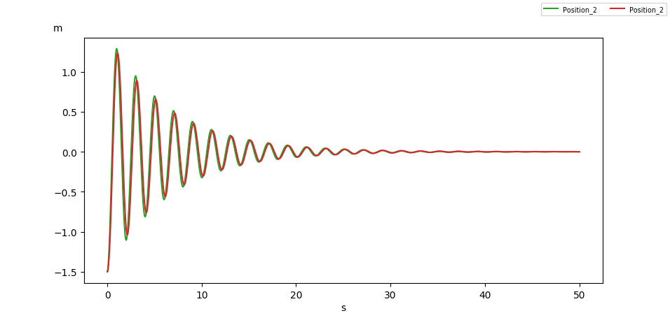

.. hydrostatics_equilibrium:

Hydrostatic equilibrium
-----------------------

The hydrostatic equilibrium of a floating body can be solved within FRyDoM by mainly two methods.
The first method is based on the direct time domain decay simulation of the body motions with proper damping models, or
relaxation (zeroing the linear and angular velocities). The second methods relies on a Newton-Raphson solver, which
solves iteratively the hydrostatic equilibrium, by computing the stiffness matrix on the body clipped mesh.

Decay tests on a box
~~~~~~~~~~~~~~~~~~~~

We simulate in time domain the hydrostatic equilibrium of a box in heave and pitch, comparing the solution given by the
linear and nonlinear approximations.

We consider a box with the following dimensions :math:`(L,B,H) = (8,4,2)m`, with a center of gravity located at the center of the box.
Its mass is taken as

.. math::
    mass = \dfrac{1}{2} \rho_{water}\times  V_{box} =  \dfrac{1}{2} \rho_{water}\times  L \times B \times H

An artificial linear damping force is introduced, to make for the hydrodynamic radiation damping. (see :any:`other_damping`).
The diagonal coefficients are taken at :math:`1E4` for the translation and rotation degrees of freedom.

.. _fig_heave_L:
.. figure:: _static/hydrostatics/heave.png
    :align: center
    :alt: decay test in heave, in small amplitude motions

    Decay test in heave, in small amplitude motions : blue = linear approximation, orange = nonlinear approximation

.. _fig_heave_NL:

    Decay test in heave, in large amplitude motions : green = linear approximation, red = nonlinear approximation

.. _fig_pitch_L:

    Decay test in pitch, in small amplitude motions : violet = linear approximation, brown = nonlinear approximation

.. _fig_pitch_NL:

    Decay test in pitch, in large amplitude motions : pink = linear approximation, grey = nonlinear approximation

Hydrostatic equilibrium solving
~~~~~~~~~~~~~~~~~~~~~~~~~~~~~~~

..
    TODO: write the theory doc of the hydrodyanmic solving : Newton-Raphson, Stiffness matrix, relaxation, equation to solve, etc.

The hydrostatic equilibrium of several bodies in different configurations is computed using the Newton-Raphson solver,
and compared to Meshmagick.

Box
+++

Initial conditions
__________________

We first consider a simple square box, which dimensions are equals to 5 meters and weights 95.906 tons, and its COG is located
at the geometric center of the box, which is also the position of the body reference frame.

The hydrostatic parameters given by Meshmagick and FRyDoM solvers are :

=============================== =============================================== ========================================
Parameters                      Meshmagick                                      FRyDoM
=============================== =============================================== ========================================
Waterplane area                 :math:`25` \\(m\\)                              :math:`25` \\(m\\)
Waterplane center               (:math:`0`, :math:`0`, :math:`0`)\\(m\\)        (:math:`0`, :math:`0`, :math:`1.25`)\\(m\\)
Hull wet surface                :math:`100`\\(m^2\\)                            :math:`100`\\(m^2\\)
Volume displacement	            :math:`93.75` \\(m^3\\)                         :math:`93.75` \\(m^3\\)
Mass displacmeent               :math:`95.906` \\(tons\\)                       :math:`95.906` \\(tons\\)
Buoyancy center                 (:math:`0`, :math:`0`, :math:`-1.875`)\\(m\\)   (:math:`0`, :math:`0`, :math:`-0.625`)\\(m\\)
Center of gravity               (:math:`0`, :math:`0`, :math:`-1.250`)\\(m\\)   (:math:`0`, :math:`0`, :math:`0.`)\\(m\\)
Draught                         :math:`3.75` \\(m\\)                            :math:`3.75` \\(m\\)
Transversal metacentric radius  :math:`0.556` \\(m\\)                           :math:`0.556` \\(m\\)
Transversal metacentric height  :math:`-0.069` \\(m\\)                          :math:`-0.069` \\(m\\)
Longitudinal metacentric radius :math:`0.556` \\(m\\)                           :math:`0.556` \\(m\\)
Longitudinal metacentric height :math:`-0.069` \\(m\\)                          :math:`-0.069` \\(m\\)
K33                             :math:`2.5089 \times 10^5` \\(N/m\\)            :math:`2.5089 \times 10^5` \\(N/m\\)
K34                             :math:`0` \\(N\\)                               :math:`0` \\(N\\)
K35                             :math:`0` \\(N\\)                               :math:`0` \\(N\\)
K44                             :math:`-6.5337 \times 10^4` \\(N.m\\)           :math:`-6.5337 \times 10^4` \\(N.m\\)
K45                             :math:`0` \\(N.m\\)                             :math:`0` \\(N.m\\)
K55                             :math:`-6.5337 \times 10^4` \\(N.m\\)           :math:`-6.5337 \times 10^4` \\(N.m\\)
=============================== =============================================== ========================================

Positions in Meshmagick are expressed in the reference frame in which the mesh is described, while the are expressed in
the body reference frame in FRyDoM. The body hydrostatic elevation given by FRyDoM is :math:`z_c = -1.25` meters, which
is the value given by Meshmagick for the COG elevation.

In FRyDoM, with the same inertia condition, but a different body reference frame (not on the geometric center but one of
its corner), we got the exact same stiffness matrix and metacentric heights. Don't forget to give the position of the COG,
in body reference frame, to the GetReport() method, since the COG position is no longer located at the body reference origin.

COG specification
_________________

We then consider the same box with a COG located at :math:`(0.5, 0.5, -1.5)` meters. Its static heel and trim are now to
be solved as well.