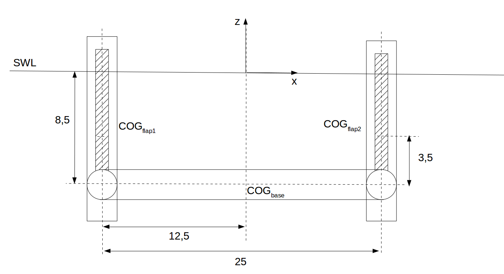
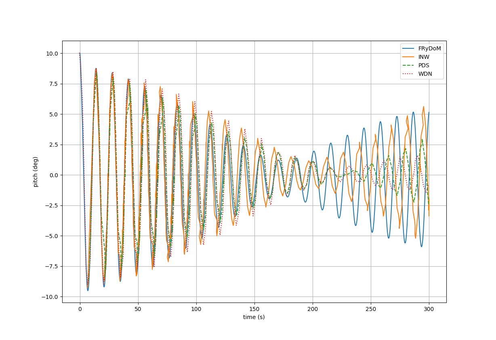
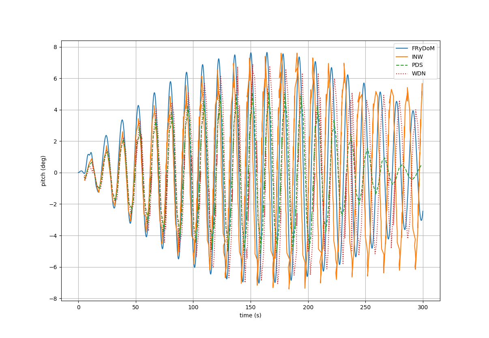

.. langlee:

Langlee benchmark
~~~~~~~~~~~~~~~~~

This benchmark focuses on the hydrodynamic interaction generated between two free moving flaps of a WEC system inspired by the Langlee device. This system has been used in the Wave Energy Converter Code Comparison Project (WEC3) [Combourieu2015]_. The objective of this project was to verify and validate mid-fidelity numerical tools designed for WEC modelling in terms of multi-body dynamics and hydrodynamic interactions.

System specification
--------------------

The floating device, inspired by the Langlee device, is composed of a semi-submersible base component with two aligned flaps as respresented in :numref:`fig_schematic_langlee`.  The flaps are rigidely linked with a revolute link to the base component and free to oscillate around the y-axis. A power take-off (PTO) system, equivalent to the linear damping, is applied to the revolute link. 

.. _fig_schematic_langlee:

    Schematic view of the system inspired by the Langlee device

Main specification of the device are sumarized in the next table with PTO coefficients.

================================= ============== ================== ==================    
                                  Base           Flap1              Flap2
================================= ============== ================== ==================
Position                          (0., 0., -8.5) (-12.5, 0., -8.5)  (12.5, 0., -8.5)
Mass (kg)                         1.09e6         1.8e5              1.8e5
Center of gravity (COG)           (0, 0, 0)      (0., 0., 3.5)      (0., 0., 3.5)
Pitch inertia (at COG)            7.65e7         1.3e6              1.3e6
PTO Damping (N.m.s)               -              4e7                4e7
================================= ============== ================== ==================

Decay test
----------

The base component is fixed in the world reference frame. Flaps are free to move relative to the base about their revolute joint. No PTO and viscous damping are applied in this test to compare with other numrerical models. The flap 1 initial position is set to 10°. Responses of the flap 1 and flap 2 are compared to other numerical results presented in [Combourieu2015]_.

.. _fig_flap1_decay_test:

    Comparison of the flap1 pitch motion for the decay test

.. _fig_flap2_decay_test:

    Comparison of the flap2 pitch motion for the decay test

References
----------

.. [Combourieu2015] A. Combourieu, M. Lawson, A. Babarit, K. Ruehl, A. Roy, R. Costello, P. Laporte Weywada, H. Bailey, "WEC3 : Wave Energy Converter Code Comparison Project", Proceedings of the 11th European Wave and Tidal Energy Conference, Sept 2015, Nantes, France

