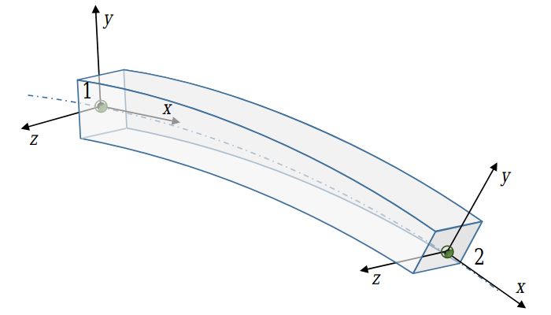

.. _dynamic_cable:

Dynamic cable (FEA)
===================

Dynamic cables are based on Finite Element Analysis (FEA) elements : thin cylindrical beams with two nodes and Euler-Bernoulli formulation.
The section and material properties are assumed constant along the beam. Stretch, torsion and flexion are included, while
shear is not considered in Euler-Bernoulli theory.

.. _fig_dynamic_cable:

    Thin beams with two nodes and Euler-Bernoulli theory

The properties of the section of the beam are defined using the following parameters :

- radius :math:`r`, in m
- area :math:`A`, in m²;
- linear density :math:`q`, in kg/m;
- Young modulus :math:`E`, in Pa;
- area moment of inertia :math:`I_{rr}`, in kg.m² ;
- shear modulus :math:`G` (for torsional effects);
- torsion constant :math:`J`;
- Rayleigh damping :math:`D_R`.

For more information about the theory, refer to [TASORA]_.

REFERENCE
---------

.. [TASORA] Tasora, 2016, Euler-Bernoulli corotational beams in Chrono::Engine, http://www.projectchrono.org/assets/white_papers/FEA/euler_beams.pdf