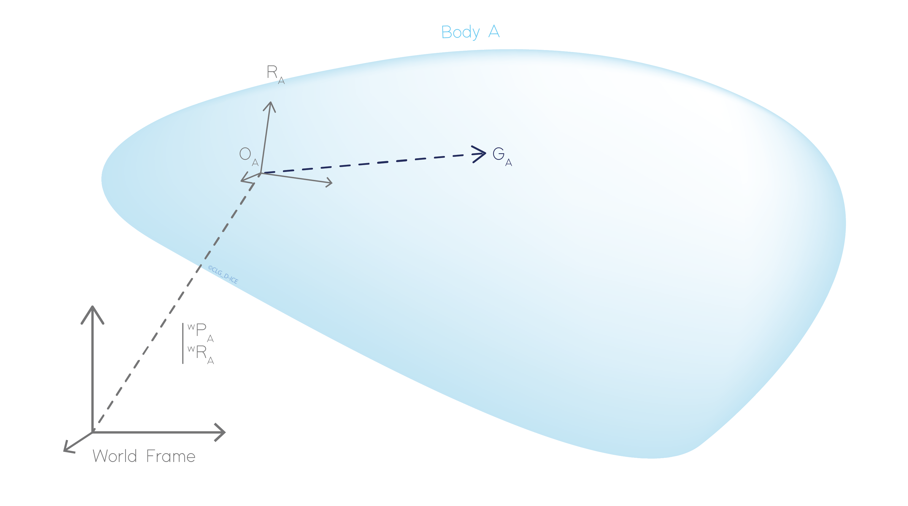

.. _body:

Bodies
======

Bodies are basic objects affected by a mass repartition and inertia properties. The position and rotation of the body are
represented by a body reference frame fixed to the body. Various external constraints can be applied to a body such as
external forces, cables, kinematic links, motors, body constraints...

Position of the Center of Gravity (COG)
---------------------------------------

Position of the center of gravity is defined in body local coordinate system with respect to the body frame of reference.

.. _body_COG:

    Representation of the Center of Gravity position (COG)

External forces and inertia properties can be set directly at the COG position or at an arbitrary position. In this last
case, transport formula are used to express such quantities at COG.

Mass and inertia
----------------

The mass :math:`m` and inertial quantities :math:`\mathbf{I}_G` of the body are defined using an inertia tensor at the
center of gravity, denoted :math:`G`.

.. math::
    \mathbb{I} = \Biggl \lbrace { m \atop \mathbf{I}_G } \Biggr \rbrace_G

In case the inertia matrix is not defined at :math:`G` but in an other point :math:`M` of the body, the generalized Huygens theorem is used to
express the inertia matrix on an other point:

.. math::
    \mathbf{I}_M = \mathbf{I}_G + \mathbf{I}(m,\mathbf{MG})

with:

.. math::
    \mathbf{I}(m,\mathbf{MG}) = m \begin{bmatrix} b^2 + c^2 & -ab & -ac\\ -ab & a^2 + c^2 & -bc \\ -ac & -bc & a^2 + b^2 \end{bmatrix}

where :math:`\mathbf{MG} = [a, b, c]`.

External forces
---------------

The external forces represent the forces and moments applied on the body. They can be applied at any arbitrary point
:math:`P` on the body. By convenient, they are represented by a force tensor :

.. math::
    \lbrace \mathcal{T} \rbrace = \Biggl \lbrace { \mathbf{F} \atop \mathbf{M}_P } \Biggr \rbrace_P

where :math:`\mathbf{F}` and :math:`\mathbf{M}_P` are respectively the force and moment applied on the body at position :math:`P`.

To compute the equivalent force tensor at COG, the transport equation is applied on the moment as follows :

.. math::
    \lbrace \mathcal{T} \rbrace = \Biggl \lbrace { \mathbf{F} \atop \mathbf{M}_P + \mathbf{GP} \wedge \mathbf{F} } \Biggr \rbrace_G

Degrees of freedom (DOFMask)
----------------------------

By default, bodies are free to move in the six degrees of freedom, corresponding to the three translations and three rotations.
However, some of these degrees of freedom can be fixed by the user in the world reference frame, by adding constraints.

.. note::
    All degrees of freedom are solved even those fixed by constraints.

.. _nodes:

Nodes
-----

Nodes are specific frames, added to the body and fixed in the body reference frame. Their position and rotation, defined
in the body reference frame, remain fixed with respect to this one during the simulation. They can be used to add :any:`links <links>`,
:any:`cables <line_theory>` or :any:`actuators <actuators>` to the body at a given position. Also, they can be used to monitor
a specific quantity on the body.

.. note::
    Like frames, translations and rotations can be applied on nodes.

