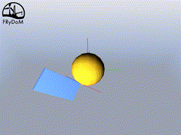
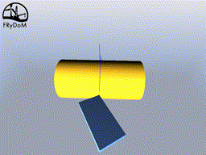
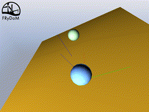
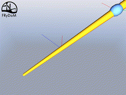
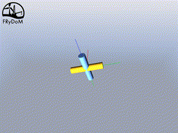
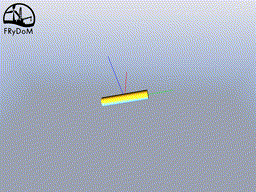

.. _constraints:

Constraints
===========

Constraints are specific kinematic links and are solved similarly. While kinematic links are used to model realistic
links between bodies, constraints are more abstract and can be used at a conceptual level.

They are based either on point, axis and plane geometric abstractions, which are relying, within FRyDoM, on nodes and
reference frames. Since nodes belong to bodies, the constraints are applied in fine on the bodies. It is however easier
to define these constraints using the geometric abstractions rather than the nodes and frames directly.

Seven different constraints are implemented in FRyDoM (see next table)

.. |PlaneOnPlane| image:: _static/PlaneOnPlane_lowRes.gif
    :align: middle

.. |DistanceBetweenPointsUrl| replace:: ``video`` Distance between points
.. _DistanceBetweenPointsUrl: https://youtu.be/8OD86MNFkTo

.. |DistanceToAxisUrl| replace:: ``video`` Distance to axis
.. _DistanceToAxisUrl: https://youtu.be/qRXM3CgV5ek

.. |PointOnPlaneUrl| replace:: ``video`` Point on plane
.. _PointOnPlaneUrl: https://youtu.be/Wn9-x4MQZyQ

.. |PointOnLineUrl| replace:: ``video`` Point on line
.. _PointOnLineUrl: https://youtu.be/h1GTgZCZCZQ

.. |PlaneOnPlaneUrl| replace:: ``video`` Plane on plane
.. _PlaneOnPlaneUrl: https://youtu.be/RaKeoT4sZVY

.. |PerpendicularUrl| replace:: ``video`` Perpendicular
.. _PerpendicularUrl: https://youtu.be/sE0xvXsiBvU

.. |ParallelUrl| replace:: ``video`` Parallel
.. _ParallelUrl: https://youtu.be/Q_uOsb45d9E

=============================== =========================== ==============================
Name                            Description                 Constrained degrees of freedom
=============================== =========================== ==============================
Distance between points         |DistanceBetweenPoints|         1 translation, 0 rotation
Distance to axis                |DistanceToAxis|                2 translations, 0 rotation
Point on plane                  |PointOnPlane|                  1 translation, 0 rotation
Point on line                   |PointOnLine|                   2 translations, 0 rotation
Plane on plane                  |PlaneOnPlane|                  1 translation, 2 rotations
Perpendicular                   |Perpendicular|                 0 translation, 1 rotation
Parallel                        |Parallel|                      0 translation, 2 rotations
=============================== =========================== ==============================

Motions are constrained with respect to the :math:`x` , :math:`y` and :math:`z` of the first body. The constraints and
joints are thus applied along the axes of the first body.
