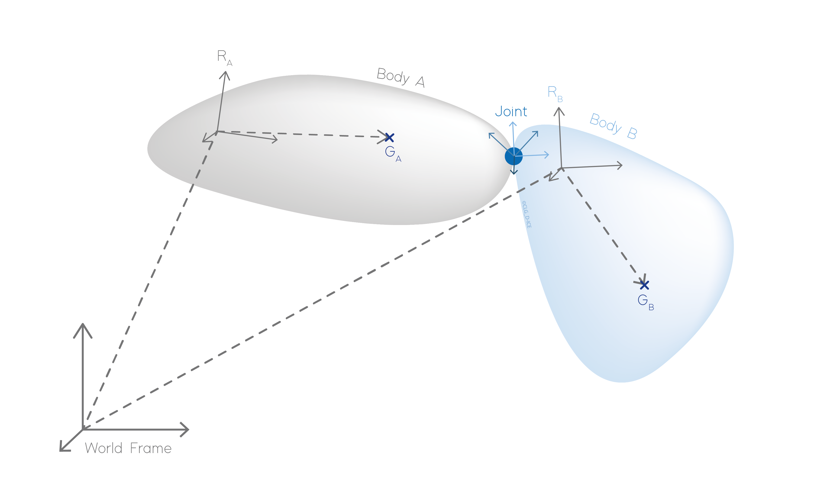

.. multibody_dynamics:

Multibody dynamics
******************

A multibody dynamics system is composed of different :any:`bodies <body>` or items linked with :any:`constraints <links>`,
:any:`actuators <actuators>`, :any:`cables <line_theory>`, etc. Each body is associated to a body reference frame, defined in
regards to the world reference frame.

.. _multibody_big_picture:

    Representation of a multibody system

.. toctree::
    :maxdepth: 2

    frame
    body/body
    links/links
    constraints/constraints
    actuators/actuators

