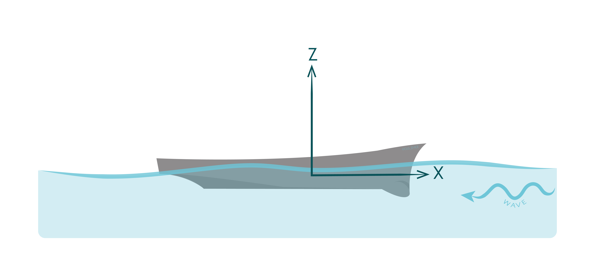

.. dtmb5512_captive_test:

DTMB5512 surface combatant in regular head waves
~~~~~~~~~~~~~~~~~~~~~~~~~~~~~~~~~~~~~~~~~~~~~~~~~

This benchmark corresponds to the simulation of the surface combatant DTMB5512 with constant forward speed submitted to regular head waves. The DTMB5512 is a 3.048m geosym of the DTMB5415 which has been chosen by the International Towing Tank Conference (ITTC) as an international benchmark for CFD validation. Two configurations are considered, captive motion and free motion in pitch and heave (3DOF). Description of this test case and comparison to experimental results are summarized in the following.

Description of the test case
----------------------------

In this simulation, the 1:46.6 scale is considered which corresponds to the laboratory scale of the DTMB 5512 geometry used in the experimental campaigned made by the Iowa Institute of Hydraulic Research (IIHR). The hull model with no appendage, no propeller and no rudder is considered. The CAD model is freely available. The main characteristics of the vessel are summarized in the following table. The x-axis is pointing forward to the vessel and z-axis is pointing upward as represented in the following figure.

.. _fig_DTMB5512_geometry:

    Description of the test case.

===================== ================ =====================
Parameter             Unit             Value
===================== ================ =====================
Scale                 -                46.6
Length (Lpp)          m                3.048
Beam                  m                0.405
Draft                 m                0.132
Wetted surface area   :math:`m^2`      1.371
LCG                   m                1.536
VCG                   m                0.162
===================== ================ =====================

Hydrostatic coefficients are summarized in the next table.

===================== ====================
Hydrostatic coeff.    Value :math:`(x10^3)`
===================== ====================
k33                   :math:`9.68`
k55                   :math:`5.42`
k35                   :math:`1.25`
===================== ====================

The DTMB5512 is mounted on a carriage with constant forward speed as represented in next figure.

.. _fig_simulation_picture:

For the captive test , the DTMB5512 model is fixed on the carriage whereas for pitch and heave motion test the DTMB5512 model is free to moove in heave and pitch. Four differents speed are considered which correspond to a low (0.19), medium (0.28), mid-high (0.34) and high (0.41) froude numbers.

The regular wave field propagates in negative x-direction. Four differents wave amplitudes are considered corresponding to small (0.025), small-median (0.05, 0.075) and median (0.1) steepness. The wave frequency is equal to 4.5 Hz.

Integration of steady forces due to forward speed
-------------------------------------------------

Resistance force (ITTC57)
..........................

Due to the forward speed the vessel is submitted to a resistance force in surge motion and additional heave and pitch steady force. These forces are determined from the experimental results in steady motion with no waves.

Resistance force is computed according to the ITTC57 standard with a hull factor :math:`k=0.03`. Based on experimental results, a residual coefficient :math:`C_R` is estimated for the different vessel speed.

================ =====================
Froude Number         Residual coeff.
================ =====================
0.19             :math:`5,37.10^{-4}`
0.24             :math:`9,07.10^{-4}`
0.34             :math:`1,68.10^{-3}`
0.41             :math:`4,02.10^{-3}`
================ =====================

User defined forces
...................

Based on the experimental results with forward speed and no waves, steady forces for pitch :math:`M_{y,user}` and :math:`F_{z,user}` are defined:

.. math::
    F_{z,user} = -12.3 u^3 - 2.9 u^2 \\
    M_{y,user} = 4.3 u^6 - 9.1 u^5 - 9.7 u^4 + 34.2 u^3 - 22.7 u^2

where :math:`u` is the steady forward speed of the vessel.

Wave drift force
................

For regular wave, the wave drift force is estimated from the following formula:

.. math::
    F_{wd} = A^2 . C_{wd}(\omega)

where :math:`A` is the wave amplitude, :math:`\omega` is the wave frequency and :math:`C_{wd}` the mean wave drift coefficient.

In this test case, the mean wave drift coefficient :math:`C_{wd}` is estimated from experimental results and added resistance given by :

.. math::
    C_{T,ad} = \bar{C_T} - C_{T,st}

where :math:`\bar{C_T}` is the mean unsteady resistance and :math:`C_{T,st}` is the steay resistance in calm water.

Estimation of the mean wave drift coefficient in surge :math:`C_{wd, x}` for various wave frequencies is represented in :numref:`fig_wave_drift_coeff`

.. _fig_wave_drift_coeff:

    Estimation of the mean wave drift coefficient depending on wave frequencies.

Adimentionalization of the forces
---------------------------------

To compare forces and moment applied on the vessel to the experimental results, the following adimentionalization is applied:

.. math::
    C_t = \frac{F_x}{0.5 \rho U^2 S} \\
    C_h = \frac{F_z}{0.5 \rho U^2 S} \\
    C_m = \frac{M_y}{0.5 \rho U^2 L S}

Following [ref], harmonic decomposition of the forces and moment are applied as follows:

.. math::
    X_F(t) = \frac{X_0}{2} + \sum_n X_n cos(2 \pi n f_e t)

where :math:`X_0` is the constant part and :math:`X_n` the :math:`n^{th}` harmonic coefficient of the function :math:`X_F`.

Captive test results
--------------------

The zeroth and first harmonic coefficients of :math:`C_T`, :math:`C_H` and :math:`C_M` are compared to experimental results in :numref:`fig_zeroth_coeff` and :numref:`fig_first_harmonic`.

.. _fig_zeroth_coeff:

    Comparison of the zeroth coefficients from FRyDoM (continous lines) with experimental results (discontinous lines).

.. _fig_first_harmonic:

    Comparison of the first harmonic coefficient from FRyDoM (continuous lines) with experimental results (discontinuous lines).

Pitch and Heave Motion test results
-----------------------------------

.. _fig_heave_motion:

    Comparison of the Heave RAO results from FRyDoM with experimental data for different regular wave frequency. Results for different froude number (0.19, 0.24, 0.34, 0.41) from left to right and top to bottom.

.. _fig_pitch_motion:

    Comparison of the Pitch RAO results from FRyDoM with experimental data for different regular wave frequency. Results for different froude number (0.19, 0.24, 0.34, 0.41) from left to right and top to bottom.

