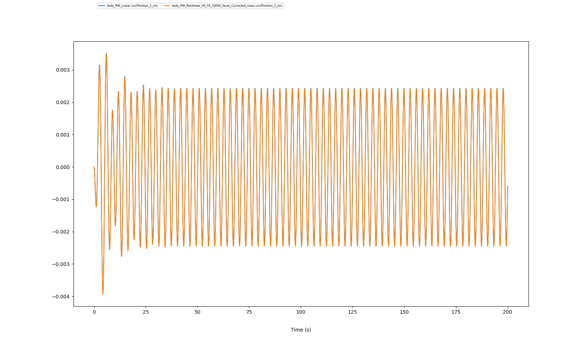

.. _heaving_sphere_regular_wave:

Heaving sphere in regular waves
~~~~~~~~~~~~~~~~~~~~~~~~~~~~~~~

This benchmark corresponds to the simulation of a sphere in heave motion submitted to regular waves. This simulation is presented by the International Energy Agency (IEA) Offshore Energy System (OES) Task 10 [OES10]_ as a benchmark case for model validation and verification regrouping 25 organizations. Description of this test case and results obtained by FRyDoM are sumarized in the following.

Description of the test case
----------------------------

The sphere considered in this simulation has a radius of :math:`5` \\(m\\) and a total mass of :math:`2,618 .10^5` \\(kg\\). At equilibrium, the center of the sphere is located on the mean water level and its center of gravity is located :math:`2` \\(m\\) below the water line. Main properties of the sphere are presented in the next table.

========================= ==================================
Parameters                Values
========================= ==================================
Radius                    :math:`5` \\(m\\)
Initial sphere location   (:math:`0`, :math:`0`, :math:`0`)
Center of gravity         (:math:`0`, :math:`0`, :math:`-2`)
Mass	                  :math:`261.8\times10^3` \\(kg\\)
Ixx                       :math:`1.690\times10^6` \\(kg.m^2\\) 
Iyy                       :math:`1.690\times10^6` \\(kg.m^2\\)
Izz                       :math:`2.606\times10^6` \\(kg.m^2\\)
Water detph               Inf
Water density             :math:`1000` \\(kg/m^3\\)
K33                       :math:`7.695\times10^5` \\(N/m\\)
K44                       :math:`5.126\times10^6` \\(N.m\\)
K55                       :math:`5.126\times10^6` \\(N.m\\)
========================= ==================================

The sphere is submitted to a regular wave field propagating positive along the x-axis. The wave periods considered in this test case varies from :math:`3` \\(s\\) to :math:`11` \\(s\\) with a steepness of :math:`0.2` %.

Results in RAO
--------------

The response amplitude operator (RAO) in heave motion obtained from FRyDoM is presented in Fig. <fig_sphere_regular_wave>_. Very good agreement with the results obtained by Nemoh [Nemoh]_ can be observed.

.. _fig_shere_regular_wave:
.. figure:: _static/sphere_regular_s0_002.png
    :align: center
    :alt: Heave RAO

For illustrative prupose, the restuls obtained from the other numerical models presented in [OES10]_ for the same test case are shown in the next figure:

.. _fig_shere_regular_wave_oes:
.. figure:: _static/sphere_regular_s0_002_oes.png
    :align: center
    :alt: Heave RAO

Effects of a nonlinear hydrostatic and Froude-Krylov approach
-------------------------------------------------------------

The time series of the same floating heaving sphere in waves are now compared. Two models are considered:

 - a fully linear model;
 - a weakly nonlinear model: the hydrostatic and Froude-Krylov loads are computed with a fully nonlinear approach.

 A single resular wave of period :math:`3` \\(s\\) and amplitude :math:`0.022` \\(m\\) is present. The two time series are plotted in :numref:`fig_sphere_regular_wave_oes`. Due to the small steepness of the waves (:math:`0.05` %), the two models match perfectly, which validates their mutual implementation in regular waves.

.. _fig_sphere_regular_wave_oes:

    
    Comparison of the time series of a floating heaving sphere in a regular wave field using a linear (blue) and fully nonlinear (orange) hydrostatic and Froude-Krylov model

References
----------

.. [OES10] F. Wendt, Y-H Yu, K. Ruehl, T. Bunnik, I. Touzon, B. W. Nam, J. S. Kim, K-H Kim, C. E. Janson, K-R. Jakobsen, S. Crowley, L. Vega, K. Rajagopalan, T. Mathai, D. Greaves, E. Ransley, P. Lamont-Kane, W. Sheng, R. Costello, B. Kennedy, S. Thomas, P. Heras, H. Bingham, A. Kurniawan, M. M. Kramer, D. Ogden, S. Girardin, A. Babarit, P.-Y. Wuillaume, D. Steinke, A. Roy, S. Betty, P. Shofield, J. Jansson and J. Hoffman, "International Energy Agency Ocean Energy Systems Task 10 Wave Energy Converter Modeleing Verification and Validation", European Wave and Tidal Energy Conference, Cork, Ireland, 2017

.. [Nemoh] A. Babarit and G. Delhommeau, "Theoretical and numerical aspects of the open source BEM solver NEMOH", in Proc. of the 11th European Wave and Tidal Energy Conference", Nantes, France, 2015.
