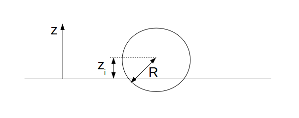
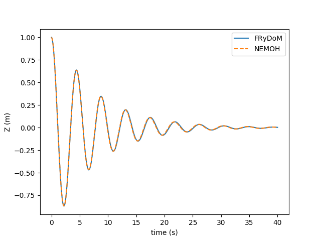
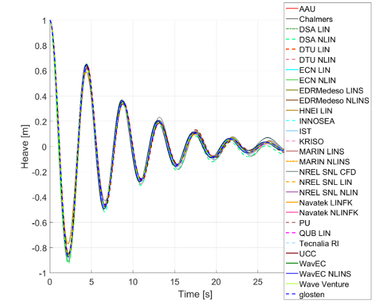

.. heavy_sphere_decay_test:

Heavy sphere in free-decay test
~~~~~~~~~~~~~~~~~~~~~~~~~~~~~~~

This benchmark corresponds to the modelisation of a sphere in free-decay test. This simulation is presented by the International Energy Agency (IEA) Offshore Energy System (OES) Task 10 [OES10]_ as a benchmark case for model validation and verification regrouping 25 organizations. Description of this test case and results obtained by FRyDoM are sumarized in the following.

Description of the test case
----------------------------

The sphere considered in this simulation has a radius of :math:`5m` and a total mass of '2,618 .10^5' kg. At equilibrium, the center of the sphere is located on the mean water level and its center of gravity is located :math:`2m`below the water line. Main properties of the sphere are presented in the next table
    
========================= =======================
Parameters                Values
========================= =======================
Radius                    5 m
Initial sphere location   (0, 0, 0)
Center of gravity         (0, 0, -2)
Mass	                  :math:`261,8.10^3` kg
Ixx                       :math:`1,690.10^6`
Iyy                       :math:`1,690.10^6`
Izz                       :math:`2,606.10^6`
Water detph               Inf
Water density             :math:`1000 kg/m^3`  
K33                       :math:`7,695.10^5`
K44                       :math:`5,126.10^6`
K55                       :math:`5,126.10^6`  
========================= =======================

At initial time the sphere is placed at a distance of 1m above the mean water level and dropped without velocity (Fig. <_fig_decay_description>).

.. _fig_decay_description

    Description of the heavy sphere test cases.

Results
-------

The position of the center of the sphere during the decay test is compared to the result obtained from Nemoh in Fig. <_fig_decay_result>. Very good agreement between the two models can be observed. 

.. _fig_decay_result:

    Free-decay motion of the sphere for the 1.0m initial displacement and comparison with Nemoh [Nemoh]_.

For illustrative purpose, the results obtained from the other numerical models in presented in [OES10]_ for the same test case are shown in next figure

.. _fig_deacy_1m_OES:

    
References
----------

.. [OES10] F. Wendt, Y-H Yu, K. Ruehl, T. Bunnik, I. Touzon, B. W. Nam, J. S. Kim, K-H Kim, C. E. Janson, K-R. Jakobsen, S. Crowley, L. Vega, K. Rajagopalan, T. Mathai, D. Greaves, E. Ransley, P. Lamont-Kane, W. Sheng, R. Costello, B. Kennedy, S. Thomas, P. Heras, H. Bingham, A. Kurniawan, M. M. Kramer, D. Ogden, S. Girardin, A. Babarit, P-Y. Wuillaume, D. Steinke, A. Roy, S. Betty, P. Shofield, J. Jansson and J. Hoffman, "International Energy Agency Ocean Energy Systems Task 10 Wave Energy Converter Modeleing Verification and Validation", European Wave and Tidal Energy Conference, Cork, Ireland, 2017

.. [Nemoh] A. Babarit and G. Delhommeau, "Theoretical and numerical aspects of the open source BEM solver NEMOH", in Proc. of the 11th European Wave and Tidal Energy Conference", Nantes, France, 2015.

