.. hydrostatics:

Hydrostatic equilibrium
-----------------------

We simulate the hydrostatic equilibrium of a box in heave and pitch, comparing the solution given by the linear and nonlinear
approximations.

We consider a box with the following dimensions :math:`(L,B,H) = (8,4,2)m`, with a center of gravity located at the center of the box.
Its mass is taken as

.. math::
    mass = \dfrac{1}{2} \rho_{water}\times  V_{box} =  \dfrac{1}{2} \rho_{water}\times  L \times B \times H

An artificial linear damping force is introduced, to make for the hydrodynamic radiation damping. (see :any:`other_damping`).
The diagonal coefficients are taken at :math:`1E4` for the translation and rotation degrees of freedom.

.. _fig_heave_L:
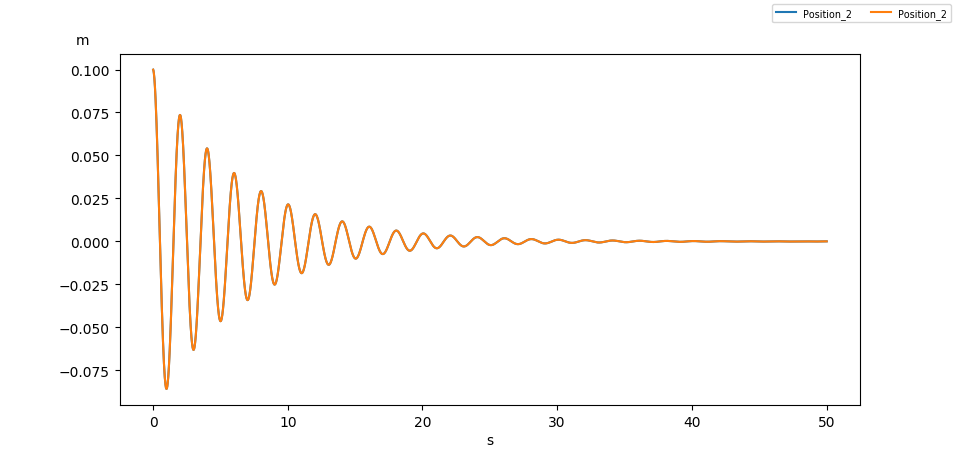

    Decay test in heave, in small amplitude motions : blue = linear approximation, orange = nonlinear approximation

.. _fig_heave_NL:
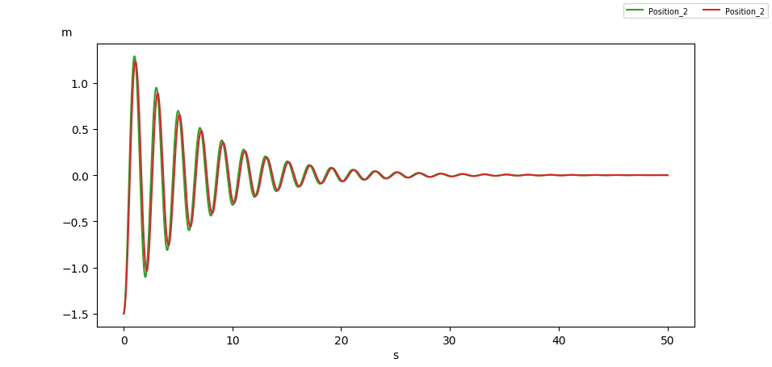

    Decay test in heave, in large amplitude motions : green = linear approximation, red = nonlinear approximation

.. _fig_pitch_L:
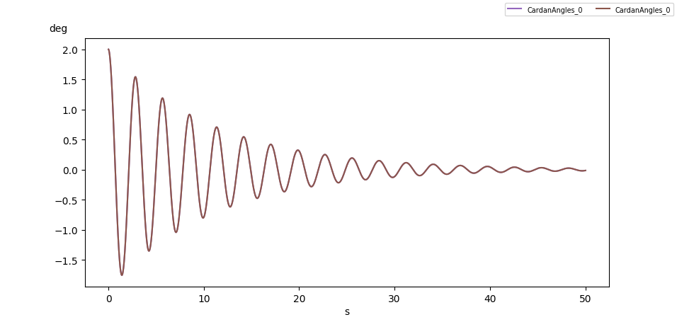

    Decay test in pitch, in small amplitude motions : violet = linear approximation, brown = nonlinear approximation

.. _fig_pitch_NL:
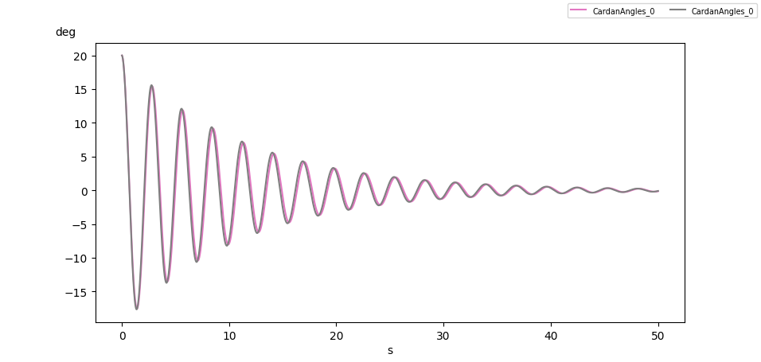

    Decay test in pitch, in large amplitude motions : pink = linear approximation, grey = nonlinear approximation

Stability analysis
------------------

The condition of initial stability for any floating structure is expressed using the metacentric heights (see :any:`stability`).

.. math::
    \left\{
    \begin{array}{lcl}
    \overline{GM_T} &\gt 0\\
    \overline{GM_L} &\gt 0
    \end{array}
    \right.

where

- :math:`\overline{GM_T}` is the transverse metacentric height,
- :math:`\overline{GM_L}` is the longitudinal metacentric height,

these height can be computed as

.. math::
     \overline{GM} = \overline{KB} + \overline{BM} - \overline{KG}

where

- :math:`K` is the lowest point on the vertical going through the gravity center of the box, which means :math:`\overline{KG} = H/2`
- :math:`B` is the buoyancy center of the box.
- :math:`\overline{BM}` is the transverse/longitudinal metacentric radius

For a parallelepipedic box, these radii are given simply as

.. math::
    \left\{
    \begin{array}{lcl}
    \overline{BM_T} &=& \dfrac{L^2}{12T}\\
    \overline{BM_L} &=& \dfrac{B^2}{12T}
    \end{array}
    \right.

where :math:`T` is the draught.

For a parallelepipedic box of uniform density :math:`c = \dfrac{\rho_{parallelepiped}}{\rho_{water}}`, this draught is

.. math::
    T = H \times c

The buoyancy center of the box is located at the center of the immersed volume

.. math::
    \overline{KG} = \dfrac{H \times c}{2}

The conditions of initial stability thus yield

.. math::
    \left\{
    \begin{array}{lcl}
    \overline{GM_T} = \dfrac{H}{2}(c-1) + \dfrac{B^2}{12H\times c} &\gt 0\\
    \overline{GM_L} = \dfrac{H}{2}(c-1) + \dfrac{L^2}{12H\times c} &\gt 0
    \end{array}
    \right.

For the previous conditions (:math:`(L,B,H) = (8,4,2)m` and :math:`c = 0.5`), these conditions are true for any density.

Unstable box
------------

For a box of dimensions :math:`(L,B,H) = (5,5,5)m`, the conditions are true only for the density values given in the
figure :numref:`fig_stab_conditions`.

.. _fig_stab_conditions:
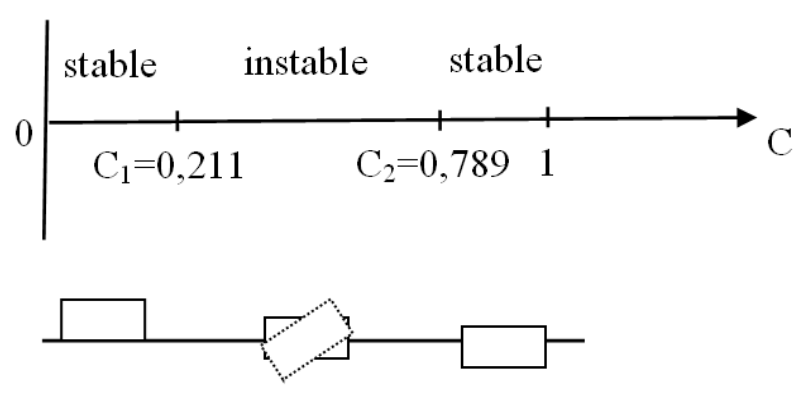

    Stability conditions of a box, depending on the density :math:`c`, courtesy [Gilloteaux]_

For a density :math:`c = 0.5`, and an initial roll angle :math:`\phi = 2^{\circ}`, the metacentric heights computed
on the box mesh are :math:`GM_T = GM_L = -0.41667`. Negative values induce unstable initial behavior of the box.

Linear approximation
~~~~~~~~~~~~~~~~~~~~

In linear approximation, the roll and pitch restoring coefficients are computed based on the metacentric heights:

.. math::
    \left\{
    \begin{array}{lcl}
    K_{44} &=& \rho g V \overline{GM_T}\\
    K_{55} &=& \rho g V \overline{GM_L}
    \end{array}
    \right.

where :math:`V` is the displacement volume.

The roll solution in linear approximation is given in the figure :numref:`fig_stab_linear`

.. _fig_stab_linear:
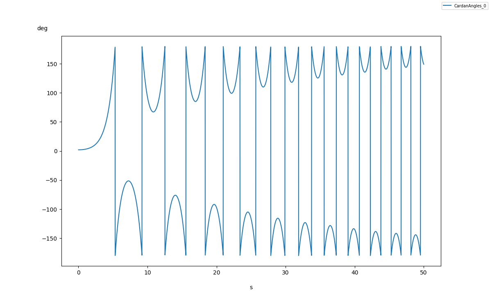

    Roll solution in linear approximation

Nonlinear approximation
~~~~~~~~~~~~~~~~~~~~~~~

In nonlinear approximation, the hydrostatic force and torque are computed on the mesh, following the box in its motions.
This means that the metacentric heights can be computed also for each position. A :math:`2^{\circ}` initial roll angle will
induce a roll and a pitch motion to reach a stable position, see below and figure :numref:`fig_stab_nonlinear_angles`

.. _fig_stab_gif:
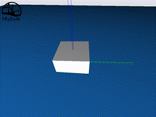

    Stabilization of the box

The damping coefficients are taken at :math:`1E5` for the rotation degrees of freedom, in order to reduce the computation time.

.. _fig_stab_nonlinear_angles:
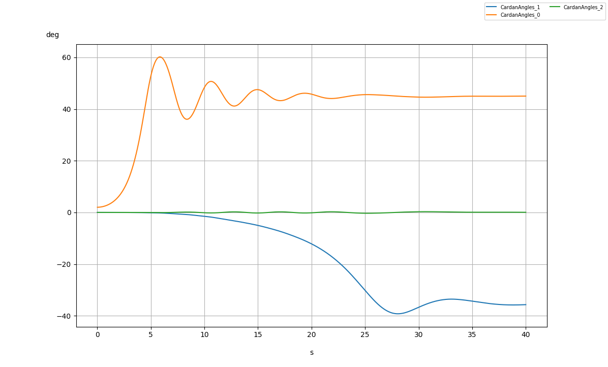

    Roll (orange), pitch (blue) and yaw (green) solutions in nonlinear approximation

The metacentric heights are shown in figure :numref:`fig_stab_nonlinear_heights` : they both start at the negative value,
given above, and finish at a positive value, indicating that the box reached a stable position.

.. _fig_stab_nonlinear_heights:
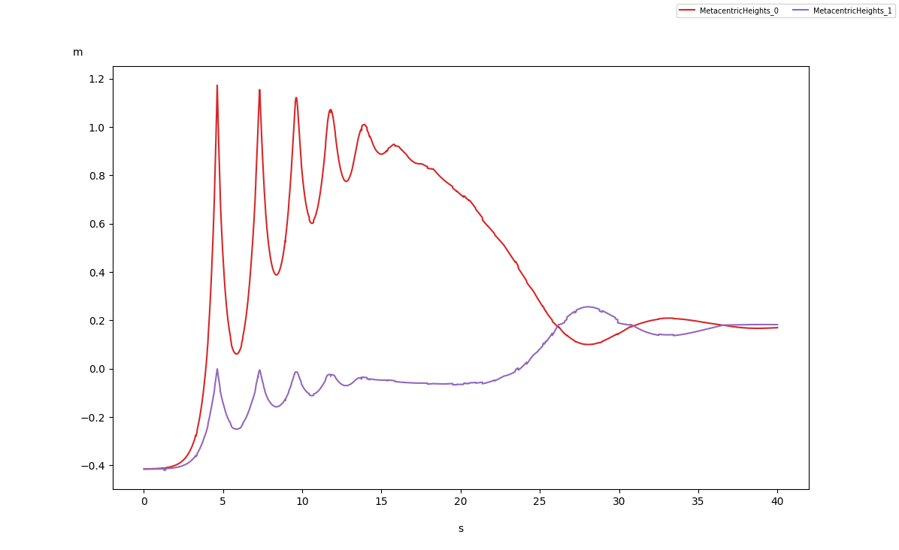

    Transversal (red) and longitudinal (violet) metacentric heights in nonlinear approximation

Box with a growing density
~~~~~~~~~~~~~~~~~~~~~~~~~~

The same box, with a varying density is considered, along with the nonlinear hydrostatic approximation :

.. math::
    c(t) = 0.1 + 0.8 \dfrac{t}{200}

The following gif :numref:`fig_stab_density_gif` and figures :numref`fig_stab_density_pos`,
:numref`fig_stab_density_heights` illustrates the behavior of the box. We can find the two density values :math:`c_1 = 0.211`
and :math:`c_2 = 0.789` for which the metacentric heights become negative. The box turns over slightly after theses two
density values, with a delay due to the inertia and damping forces. The first turn over ends up on the orientation previously
observed (roll at 45 degrees and pitch around 33 degrees). For the second turn over, the box recovers its initial orientation
(zero roll and pitch) but with a 15 degrees yaw angle.

.. _fig_stab_density_gif:
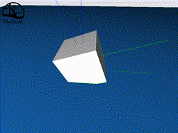

    Stabilization of the box, with varying density

.. _fig_stab_density_pos:
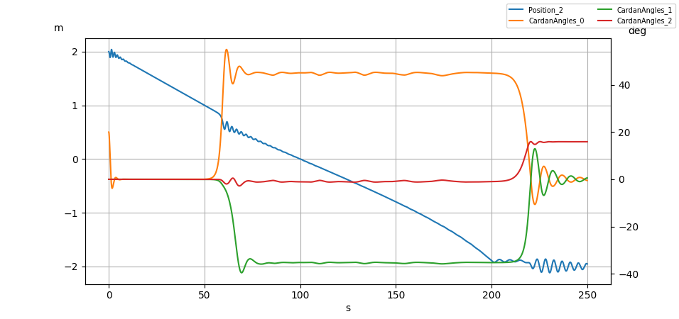

    heave (blue), roll (orange), pitch (green) and yaw (red) solutions with varying density

.. _fig_stab_density_heights:
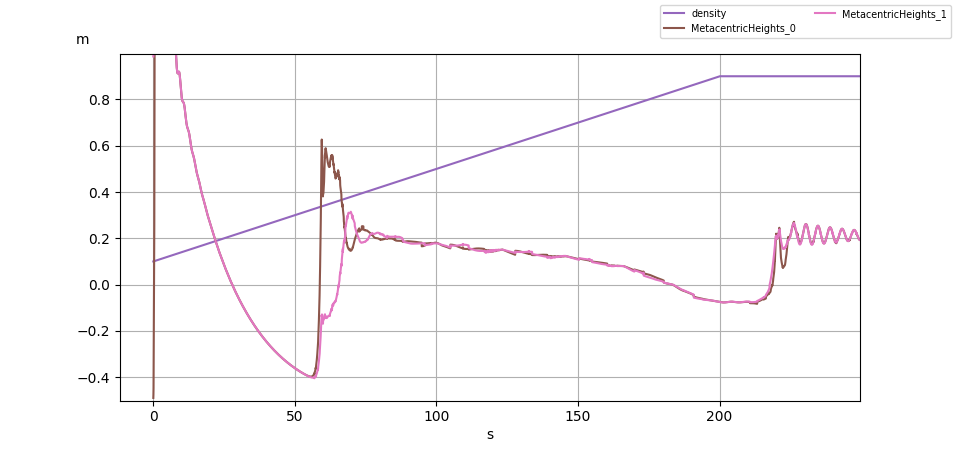

    box density (violet), transversal (pink) and longitudinal (brown) metacentric heights with varying density

References
----------

.. [Gilloteaux] Gilloteaux, J. C. (2007). Mouvements de grande amplitude d'un corps flottant en fluide parfait. Application à la récupération de l'énergie des vagues (Doctoral dissertation).