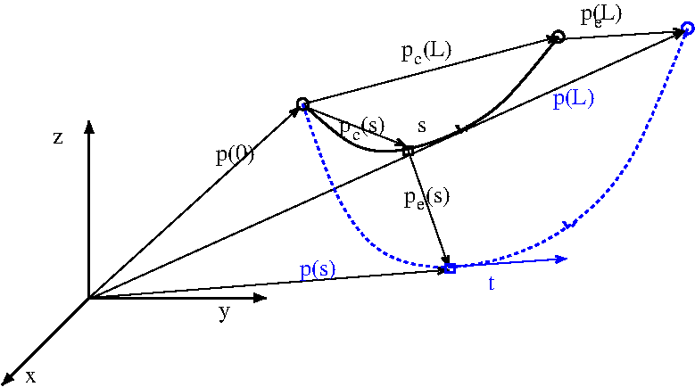

.. _cable:

Cable models
============

Quasi static catenary line
~~~~~~~~~~~~~~~~~~~~~~~~~~

The catenary line model implemented in FRyDoM is based on the elastic catenary theory [GRECO]_, under the assumptions of
uniformly distributed load. It is a quasi static approach, in which we look for the :any:`equilibrium configuration <fig_catenary_theory>`.
Let us consider a line, of unstretched length :math:`L`, with line ends located respectively at :math:`\mathbf{p}(0)` and :math:`\mathbf{p}(L)`.

.. _fig_catenary_theory:

    Unstrained configuration (in solid black) and strained configuration (in dashed blue), under uniform distributed load.

The equilibrium equation for a segment :math:`[0,s]`, with :math:`s \leq L`, is given by:

.. math::
    \mathbf{t}(s) = \mathbf{t}_0 - s \mathbf{q}

where

- :math:`\mathbf{t}(s)`  is the line tension applied by the segment :math:`[0,s]` to the rest of the line,
- :math:`\mathbf{t}_0` is the tension force at the origin.
- :math:`\mathbf{q} = q \mathbf{u}` is the uniformly distributed load

The position of the line at the abscisse :math:`s` is given by:

.. math::
    \mathbf{p}(s) = \mathbf{p}(0) + \mathbf{p}_c(s) + \mathbf{p}_{\epsilon}(s)

where

.. math::
    \mathbf{p}_{\epsilon}(s) &=& \frac{q.s}{EA} \left(\frac{\mathbf{t}_0}{q} - \frac{s}{2} \mathbf{u} \right)\\
    \mathbf{p}_c(s) &=& \left(\mathbb{I} - \mathbf{u} \mathbf{u}^T \right) \frac{\mathbf{t}_0}{q} \ln\left[\frac{\rho(s)}{\rho(0)} \right] - \mathbf{u} \left( \left\| \frac{\mathbf{t}_0}{q} - s \mathbf{u} \right\| - \left\| \frac{\mathbf{t}_0}{q} \right\| \right)\\
    \rho(s) &=& \left\| \mathbf{t}(s) \right\| - \mathbf{u}^T \mathbf{t}(s)

REFERENCES
----------

.. [GRECO] Greco, L., Impollonia, N., Cuomo, M., *A procedure for the static analysis of cables structures following elastic catenary theory*, International Journal of Solids and Structures, pp 1521-1533, 2014

FEA dynamic cable
~~~~~~~~~~~~~~~~~

