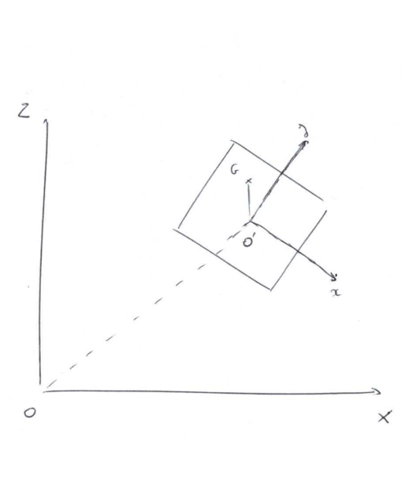
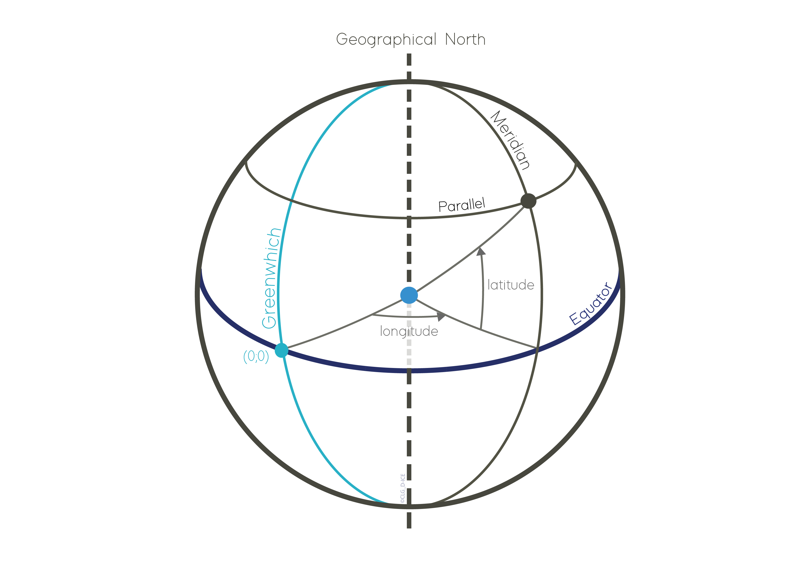

.. _coordinate_system:

Coordinate systems
******************

Cartesian coordinates systems
===================

Coordinates systems are defined in FRyDoM in three dimensions using the right-hand rule. The main reference frame is the world reference frame, denoted :math:`W_{XYZ}`, which origin can be set at a specific geographic position. Local frames are also defined for each :any:`bodies <body>` and :any:`nodes <node>`. The following figure illustrates the world reference frame (*World Frame*) and a body, with its coordinates system :math:`(O_A, R_A)` and its center of gravity :math:`G_A`. :math:`P_A` and :math:`R_A` are respectively the position and the rotation of the *Body A* in the *World Frame*.

.. _fig_world_frame::

    Representation of the world and body reference frame.
        
Frame definition, transformation and composition are detailed in \
:any:`frame theory <frame>`.

Two :any:`frame conventions <conventions>` can be used in FRyDoM :

- North, West, Up (NWU), with z-axis pointing upward
- North, East, Down (NED), with z-axis pointing downward.

This frame convention must be specified for setting/getting positions, velocities, directions, etc.

By convention FRyDoM uses the NWU frame convention but either NED or NWU convention can be used by the user to defined or extract the majority of position, velocity and acceleration of related data.

Environment related items (wind, current, waves, etc.) are generally given in the world reference frame. Position, velocity
and acceleration of a body can be specified in both world reference frame of local body coordinates system. Properties
of bodies depending of its orientation are usually given in the body local reference frame : drag, polar coefficients,
hydrodynamic database, etc. Only the inertia tensor can be given for any reference frame (world, local or other).

.. note::
    Reference frames can be drawn in Irrlicht through the user interface (type 'i' in the   Irrlicht  environment and check 'Draw COGs'. Increase the 'Symbol scale' if needed.)

Geographic coordinates system
=============================

The geographic coordinates system allows to represent the position of any point located on Earth, based on its
latitude, longitude and elevation. Reported to a plane, the latitude and longitude represent the horizontal position, while the
elevation represents the vertical position with z-axis pointing upward.

.. _fig_geographic_coordsys::

    Longitude lines are perpendicular to the Equator and latitude lines are parallel to the Equator.

Geographic coordinates in FRyDoM is based on the GeographicLib library, with the default Earth Geocentric (Geocentric::WGS84).
For more information about the coordinate system definition, refer to \
`GeographicLib documentation <https://geographiclib.sourceforge.io/html/python/>`_

Conversion from/to cartesian coordinates
~~~~~~~~~~~~~~~~~~~~~~~~~~~~~~~~~~~~~~~~

GeographicLib provides methods to convert geographic coordinates from/to cartesian coordinates, which are wrapped in
FRyDoM. The world reference frame origin can be set at a specified geographic coordinates, and
bodies position can be returned as geographic coordinates as well. Other FRyDoM methods using GeographicLib are
implemented.
