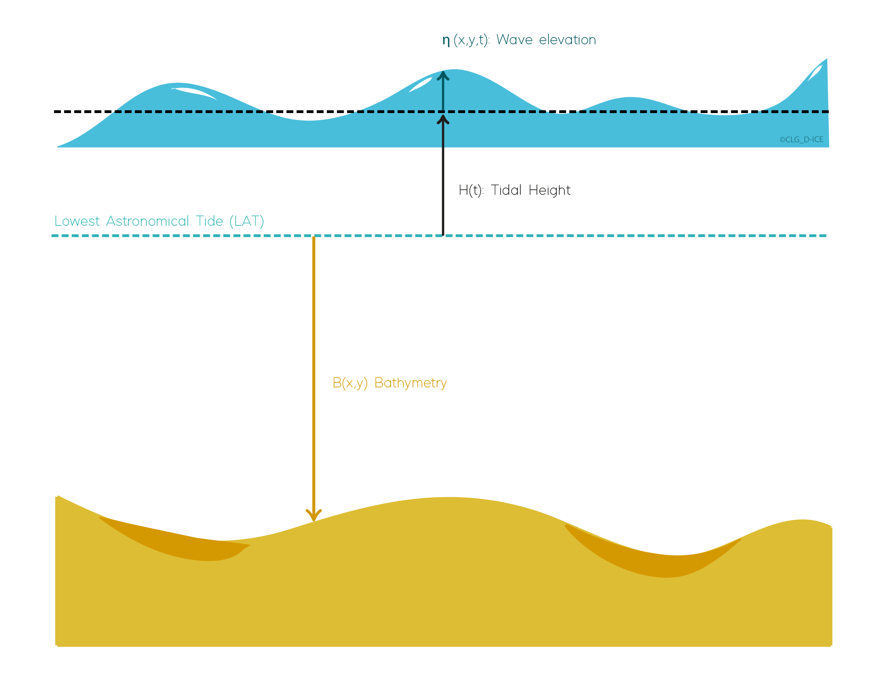

.. chart_datums:

Chart Datums
============

The chart datum is defined using the Lowest Astronomical Tide (LAT) : it is the lowest tide level which can be predicted
to occur under average meteorological conditions and under any combination of astronomical conditions. [LAT]_

Several heights can be given using this chart datum (see :any:`following figure <heights>`):

- :math:`B(x,y)` : bathymetry, varying in space,
- :math:`H(t)` : tidal height, given by the tidal model,
- :math:`\eta(x,y,t)` : wave elevation, given by the :any:`wave field model<wave_theory>`,
- :math:`H(t)+\eta(x,y,t)` : free surface position, relatively to the LAT,
- :math:`H(t)-B(x,y)` : ocean depth, relatively to the free surface.

.. _heights:

    Chart datum, wave elevation, tidal height and bathymetry definitions

References
----------

.. [LAT]  RESOLUTIONS of the INTERNATIONAL HYDROGRAPHIC ORGANIZATION Publication M-3 2nd Edition - 2010 Updated to December 2016. SECTION 2.2 – TIDES AND WATER LEVELS para 2 note (i)

