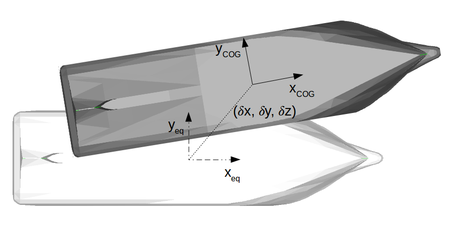

.. _hydrodynamic_forces:

Linear potential flow theory
~~~~~~~~~~~~~~~~~~~~~~~~~~~~

The linear potential flow theory is a common approach for seakeeping analysis of offshore structures. It is based on the
following assumptions: incompressible and non viscous fluid, and irrotational flow.

The position of the body is also linearized around an equilibrium position, defined in FRyDoM by the  :any:`equilibrium frame <equilibrium_frame>`.
For offshore structure with no forward speed, this position is the position of the body at the equilibrium state.
For offshore structure with non-zero forward speed, the equilibrium frame follows the constant steady velocity of the structure.
:any:`The following figure<fig_equilibrium_frame>` represents the instantaneous position of the body and the equilibrium frame position.

.. _fig_equilibrium_frame:

    Representation of the instantaneous position of the ship (grey) and equilibrium position (white)

In time domain, the dynamic of the body due to wave loads is represented by the Cummin’s equation:

.. math::
    \left( \mathbf{M} + \mathbf{A}_{\infty} (U) \right) \mathbf{\ddot{x}}(t) + \mathbf{B}_{\infty}(U) \mathbf{\dot{x}}(t) + \int_0^t \mathbf{K}(t-\tau,U) \mathbf{\dot{x}}(\tau) d\tau + \mathbf{K}_h \mathbf{x} = \mathbf{f}_E(t) + \mathbf{f}_{EXT}(t)

where

- :math:`\mathbf{x}` is the generalized position vector in respect to the equilibrium frame,
- :math:`U` is the steady forward speed of the body,
- :math:`M` is the generalized mass matrix of the body,
- :math:`\mathbf{A}_{\infty}` and :math:`\mathbf{B}_{\infty}` are the infinite added mass and damping coefficients,
- :math:`\mathbf{K}` is the impulse response function,
- :math:`\mathbf{K}_h` is the stiffness matrix,
- :math:`\mathbf{f}_e` is the generalized wave excitation force,
- :math:`\mathbf{f}_{ext}` is the generalized external force,

Hydrostatic force
-----------------

The generalized hydrostatic static force expression for the linear approximation is given by

.. math::
    \mathbf{f}_H = \mathbf{K}_h \mathbf{x}

where

- :math:`\mathbf{x}` is the generalized position vector, in respect to the equilibrium frame,
- :math:`\mathbf{K}_h` is the stiffness matrix.

Stiffness coefficients for the horizontal degrees of freedom (surge, sway and yaw) are zero. The stiffness components
for the heave, roll and pitch degrees of freedom are specified in respect to the equilibrium frame.

Excitation force
----------------

The generalized excitation force, given by the linear approximation, is:

.. math::
    \mathbf{f}_E = \Im \left( \int_0^\infty A_{\omega} \mathbf{f}_e(\omega) \exp\left(jkx - j\omega_e t \right)  d\omega \right)

where

- :math:`\omega_e = \omega - kU` is the encounter circular frequency, calculated using the steady forward speed,
- :math:`A_{\omega}` is the wave amplitude for the circular frequency :math:`\omega`,
- :math:`\mathbf{f}_e(\omega)` is the excitation force component for the circular frequency :math:`\omega`.

The excitation force components are given by a linear potential flow solver (Nemoh, etc.). It is the combination of diffraction
force components and Froude-Krylov force components (integration of the pressure due to incident wave profile on the
wetted hull.)

Radiation force
---------------

The generalized radiation force, given by the linear approximation, is:

.. math::
    \mathbf{f}_R = \mathbf{A}_{\infty} (U) \mathbf{\ddot{x}}(t) + \mathbf{B}_{\infty}(U) \mathbf{\dot{x}}(t)
                    + \int_0^t \mathbf{K}(t-\tau,U) \mathbf{\dot{x}}(\tau) d\tau

where

- :math:`\mathbf{x}` is the generalized position vector, in respect to the equilibrium frame,
- :math:`\mathbf{A}_{\infty} (U)` and :math:`\mathbf{B}_{\infty} (U)` are the infinite added mass and damping coefficient,
- :math:`\mathbf{K}` is the impulse response function.

The infinite added mass and damping coefficients are given by a linear potential flow solver. The impulse response can be
computed from the damping coefficients.

.. math::
    \mathbf{K}(t) = \frac{2}{\pi} \int_0^{\infty} \mathbf{B}(\omega) \cos(\omega t) d\omega

Mean wave drift force
---------------------

The generalized mean wave drift force, given by the linear approximation, is:

.. math::
    \mathbf{f}_{WD} = \int_0^{2\pi} \int_0^{\infty} A(\omega,\theta) \mathbf{C}(\omega_e,\alpha) d\omega d\theta

where

- :math:`A_(\omega,\theta)` is the wave amplitude for the circular frequency :math:`\omega`, and wave direction :math:`\theta`,
- :math:`\omega_e` is the encounter circular frequency, which depends on :math:`(\omega,\theta)`,
- :math:`\alpha` is the relative angle between the wave direction and body heading.
- :math:`\mathbf{C}(\omega_e,\alpha)` are the polar wave drift coefficients, which depend on :math:`(\omega_e,\alpha)`

