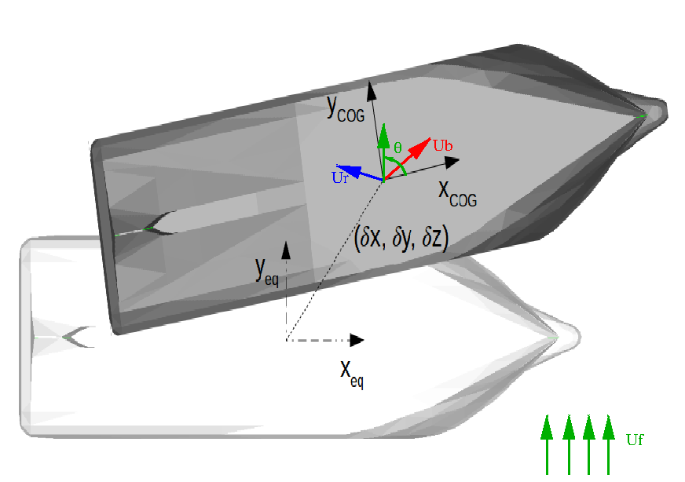

.. current_and_wind_loads:

Current and wind drag loads due to translational relative velocity
------------------------------------------------------------------

Current and wind loads are computed using the standard OCIMF method. For further details see [OCIMF]_.
This method has been developed for tankers but can be applied on other vessel types, if polar coefficients are provided.
According to this method, only drag loads due to surge and sway relative velocity is considered; no drag loads due to
yaw angular velocity is modeled.

..
    [CC : rajouter une courte présentation des méthodes OCIMF ou au minima le principe de base]

.. note::
    While the OCIMF method calculates the drag loads on stationary bodies, with an absolute fluid velocity,
    FRyDoM consider instead the relative fluid velocity past the body.

The generalized flow force, given by the OCIMF formulae, is :

.. math::
    \mathcal{F}_{flow} = \frac{1}{2} \rho_{fluid} \begin{bmatrix}  C_X(\theta) A_X \\ C_Y(\theta) A_Y \\ 0\\0\\0\\ C_N(\theta) A_N  \end{bmatrix} |\mathbf{u}|^2

where

- :math:`(C_X, C_Y, C_N)` are the polar flow coefficients, respectively in surge sway and yaw, relatively to :math:`\theta` (no dimension),
- :math:`\rho_{fluid}` is the fluid density (air or water),
- :math:`\mathbf{u}` is the relative velocity of the fluid, past the body. See the :any:`following figure <fig_relative_flow_velocity>`.
..  [CC: preciser. Est-ce qu'il s'agit de la vitesse relative par rapport à la vitesse instantannée du navire ou est-ce que l'on considère la vitesse stationnaire du navire ?]
- :math:`\theta` is the angle between the body heading and fluid flow velocity.
..  [CC: attention on utilise \alpha ailleurs pour cet angle (Mean wave drift force)]
- :math:`A_X, A_Y, A_N` are the projected area of the body: above the waterline for the wind, below the waterline for the current.

.. note::
    The surge and sway forces are calculated in the body reference frame and projected on the horizontal plane of the world
    reference frame afterwards, so that we do not get any vertical components. The yaw moment is also projected, so that
    the moment acts about the vertical direction only.

.. _fig_relative_flow_velocity:

    Relative flow velocity, past the body
..
    REFAIRE CETTE FIGURE !!!

..
    The computations are done within FRyDoM in NWU and GOTO conventions, however you can give polar coefficients in NED or NWU and in GOTO or COMEFROM, convention.

References
__________
.. [OCIMF] Oil Companies International Marine Forum, 1994. Prediction of Wind and Current Loads on VLCCs, 2nd edition, Witherby & Co., London.