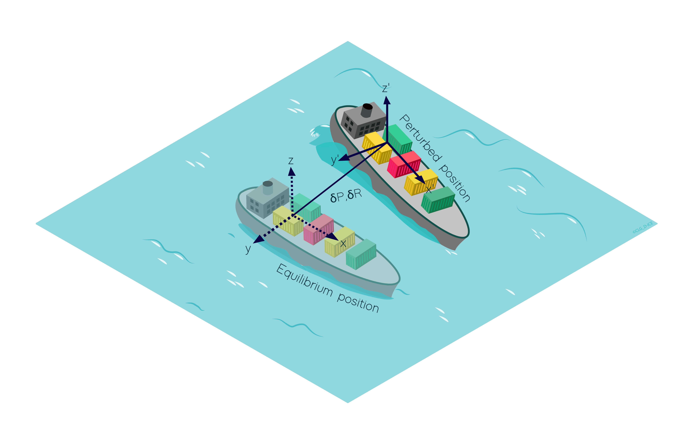

.. _linear_potential_flow_theory:

Linear potential flow theory
~~~~~~~~~~~~~~~~~~~~~~~~~~~~

Hypothesis
==========

The linear potential flow theory is a common approach for seakeeping analysis of offshore structures. It is based on the
following assumptions: incompressible and irrotational flow and non viscous fluid.

By assuming small amplitude motions of the body, the position of the body is linearized around its equilibrium position,
defined in FRyDoM by the  :any:`equilibrium frame <equilibrium_frame>`. By assuming small wave amplitude, the free
surface is linearized around the mean sea level `z = 0`.

Cummins method
==============

In time domain, the dynamic of the body due to wave loads is represented by the Cummin’s equation:

.. math::
    \left( \mathbf{M}_{kl} + \mathbf{A}_{\infty, kl} \right) \mathbf{\ddot{x}}_l(t) + \mathbf{B}_{\infty, kl} \mathbf{\dot{x}}_l(t) + \int_0^t \mathbf{K}_{kl}(t-\tau) \mathbf{\dot{x}}_l(\tau) d\tau + \mathbf{K}_{h, k} \mathbf{x}_k = \mathbf{f}_{E, l}(t) + \mathbf{f}_{EXT, l}(t)

where

- :math:`k` and :math:`l` are the index of the bodies;
- :math:`\mathbf{x}` is the generalized position vector in respect to the equilibrium frame;
- :math:`\mathbf{M}` is the generalized mass matrix of the body;
- :math:`\mathbf{A}_{\infty}` and :math:`\mathbf{B}_{\infty}` are the infinite added mass and damping coefficients;
- :math:`\mathbf{K}` is the impulse response function;
- :math:`\mathbf{K}_h` is the stiffness matrix;
- :math:`\mathbf{f}_e` is the generalized wave excitation force;
- :math:`\mathbf{f}_{ext}` is the generalized external force.

For more information on linear model forces, refer to

- :any:`Hydrostatic force <linear_hydrostatics>`
- :any:`Froude-Krylov force <linear_FroudeKrylov>`
- :any:`Diffraction force <linear_diffraction>`
- :any:`Radiation force <radiation>`
- :any:`Wave drift force <wave_drift>`

.. _equilibrium_frame:

Equilibrium frame
===================

.. décrire ici à quoi servent les repères d'équilibre

By assuming small amplitude motions of the body, the position of the body is linearized around its equilibrium position,
defined in FRyDoM by the equilibrium frame.
For offshore structures with no forward speed, this position is the position of the body at the equilibrium state.
For offshore structure with non-zero forward speed, the equilibrium frame follows the constant steady velocity of the structure.
:any:`The following figure<fig_equilibrium_frame>` represents the instantaneous position of the body and the equilibrium frame position.

.. _fig_equilibrium_frame:

    Representation of the instantaneous position of the ship (grey) and equilibrium position (white)

The equilibrium frame is a frame with the z-axis pointing upward, internal velocities and dynamic behaviour. The generic
equilibrium frame has a constant speed in the horizontal plane and eventually a constant rotation speed around Z. If the
position, orientation and velocity of the equilibrium frame are not defined by the user, they are initialized to the
values given by the body at COG during the initialization stage.

Mean motion system
------------------

In this approximation, the velocity :math:`\dot{x}_{eq}` of the equilibrium frame and angular speed around z-axis :math:`\dot{\Psi}_{eq}` are equal to the mean motion and yaw velocity of the body at COG.

.. math::
    \dot{x}_{eq} = \int_{t-Te}^t \dot{x}(\tau)d\tau

.. math::
    \dot{\Psi}_{eq} = \int_{t-Te}^t \dot{\Psi}(\tau) d\tau

with :math:`x` and :math:`\Psi` the instantaneous position and yaw angle of the body at COG and :math:`T_e` the elapsed time for mean motion (specified by the user).

The position of the equilibrium frame is computed with Euler integration scheme.

.. math::
    x^{n+1}_{eq} = x^n_{eq} + \dot{x}_{eq} dt \\
    \Psi^{n+1}_{eq} = \Psi^n_{eq} + \dot{\Psi}_{eq} dt

A correction step can be applied on the equilibrium frame position to limit too large deviation with respect to the exact body position.

.. math::
    x_{eq} = x^*_{eq} + \alpha \int_{t-T_e}^t (x(\tau)-x^*_{eq}) d\tau \\
    \Psi_{eq} = \Psi^*_{eq} + \beta \int_{t-T_e}^t (\Psi(\tau) - \Psi^*_{eq}) d \tau

where :math:`x^*_{eq}` and :math:`\Psi^*_{eq}` are the equilibrium frame position and yaw angle before correction and (:math:`\alpha`, :math:`\beta`) are correction coefficient.

Spring-damping system
---------------------

In that case, the position of the equilibrium frame :math:`x_{eq}` is solution of a second order differential equation equivalent to a mass-spring damping system with unit mass :

.. math::
    \ddot{x}_eq + 2\xi\omega_0 (\dot{x}_{eq} - \dot{x}) + \omega_0^2 (x_{eq} - x) = 0

where :math:`\omega_0` is the natural period of the system and :math:`\xi` is the damping rate coefficient.

The behaviour of the system is adjusted with :math:`T_0 = 2\pi/\omega_0`, which can be seen as a "cutoff time" in seconds and :math:`\xi` the damping rate coefficient.

[graphique avec la localisation de T0 et pour différentes valeurs de :math:`\xi` ?]
