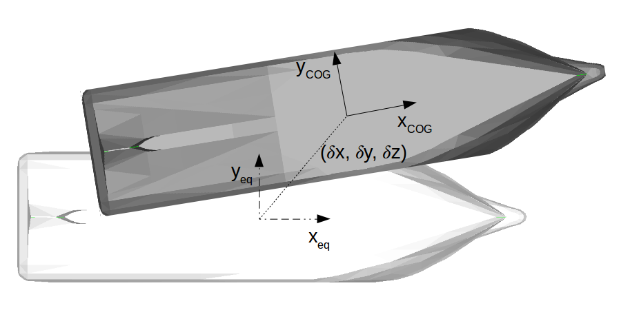

.. _equilibrium_frame:

Equilibrium frame
===================

.. décrire ici à quoi servent les repères d'équilibre

By assuming small amplitude motions of the body, the position of the body is linearized around an equilibrium position,
defined in FRyDoM by the equilibrium frame.
For offshore structure with no forward speed, this position is the position of the body at the equilibrium state.
For offshore structure with non-zero forward speed, the equilibrium frame follows the constant steady velocity of the structure.
:any:`The following figure<fig_equilibrium_frame>` represents the instantaneous position of the body and the equilibrium frame position.

.. _fig_equilibrium_frame:

    Representation of the instantaneous position of the ship (grey) and equilibrium position (white)

The equilibrium frame is a frame with the z-axis pointing upward, internal velocities and dynamic behaviour. The generic
equilibrium frame has a constant speed in the horizontal plane and eventually a constant rotation speed around Z. If the
position, orientation and velocity of the equilibrium frame are not defined by the user, they are initialized to the
values given by the body at COG during the initialization stage.

Mean motion system
------------------

.. décrire ici la théorie derrière le repère d'équilibre Mean motion

In this approximation, the equilibrium frame varies with a velocity equal to the mean motion of a body.

The velocity of the frame is equal to the mean value of the body velocity during a period of time specified by the user.
Past velocities are recorded in a buffer with a specific time stepper.

Spring damping system
---------------------

.. décrire ici la théorie derrière le repère d'équilibre Spring damping

The velocity of the equilibrium frame is solution of a dynamic equation with spring and damping forces. This system
creates a low pass filter on the velocity of the body. The spring-damping system is defined from T0, the cutoff time in
seconds, and psi the damping rate coefficient.

