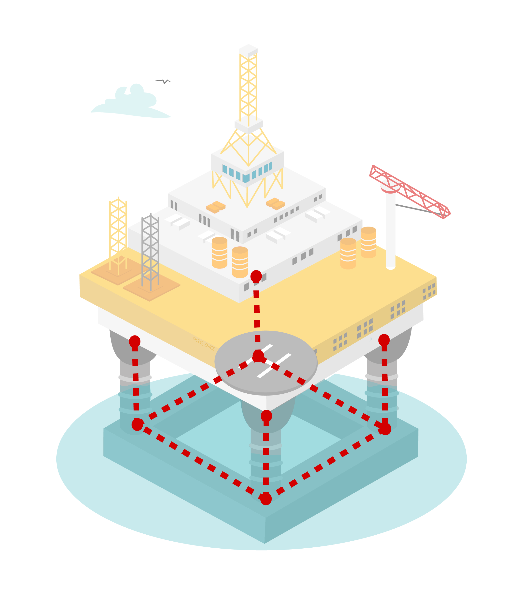

.. _morison_force:

Morison model and force
~~~~~~~~~~~~~~~~~~~~~~~

Morison model
-------------

The Morison model is generally designed to incorporate in the simulation second order wave loads on a
structure coming from drag and inertial effects such as viscous effects or turbulence. The Morison model is also used in case of a small body compared to the wave length. In the FRyDoM
framework, the Morison model can be applied to any offshore structure. A Morison model can be
composed of multiple Morison elements, corresponding to a cylinder with drag and added mass
coefficients. :any:`The following figure <fig_morison_model>` represents the definition a Morison structure applied on a platform. A Morison
element is defined by a couple of two points (represented by black dots) corresponding to the extremity of
the cylinder and a discretization.

.. _fig_morison_model:

    Example of an Morison model for a platform

Morison force on a Morison element
----------------------------------

Each Morison element is associated to a local frame located at the middle of the Morison element (Figure 4).
By default, this local frame has its third axis :math:`\mathbf{e3}` parallel to the direction of the Morison element,
the first axis :math:`\mathbf{e1}` is  parallel to the horizontal plane XY and :math:`\mathbf{e2}` is defined such that the frame
:math:`(\mathbf{e1}, \mathbf{e2}, \mathbf{e3})` is orthonormal direct.

[CC : rajouter la figure pour les conventions d'orientation de frame]

The Morison force in the local frame coordinates is defined as follows:

.. math::
	f_M^i = \rho V \left[\dot{u}^i + C_a^i \left(\dot{u}^i - \ddot{X}^i\right)\right] + \frac{1}{2} \rho D L C_d^i \left(u^i - \dot{X}^i\right)\left|u^i - \dot{X}^i\right|

where

- :math:`i` can be 1 or 2,
- :math:`f^i` is the force component along the ith axis,
- :math:`C_a^i` is the added mass, along the ith axis,
- :math:`C_d^i` is the drag coefficient, along the ith axis,
- :math:`\rho` is the water density,
- :math:`V, D` and :math:`L` are the volume, diameter and length of the Morison element respectively,
- :math:`u^i` is the flow velocity,
- :math:`\dot{X}^i` is the absolute velocity of the center at the middle of the Morison element,

In this formulation, anisotropic Morison element can be represented by a set of anisotropic definition of the added mass
and drag coefficients in function of the axis direction.

References
----------

