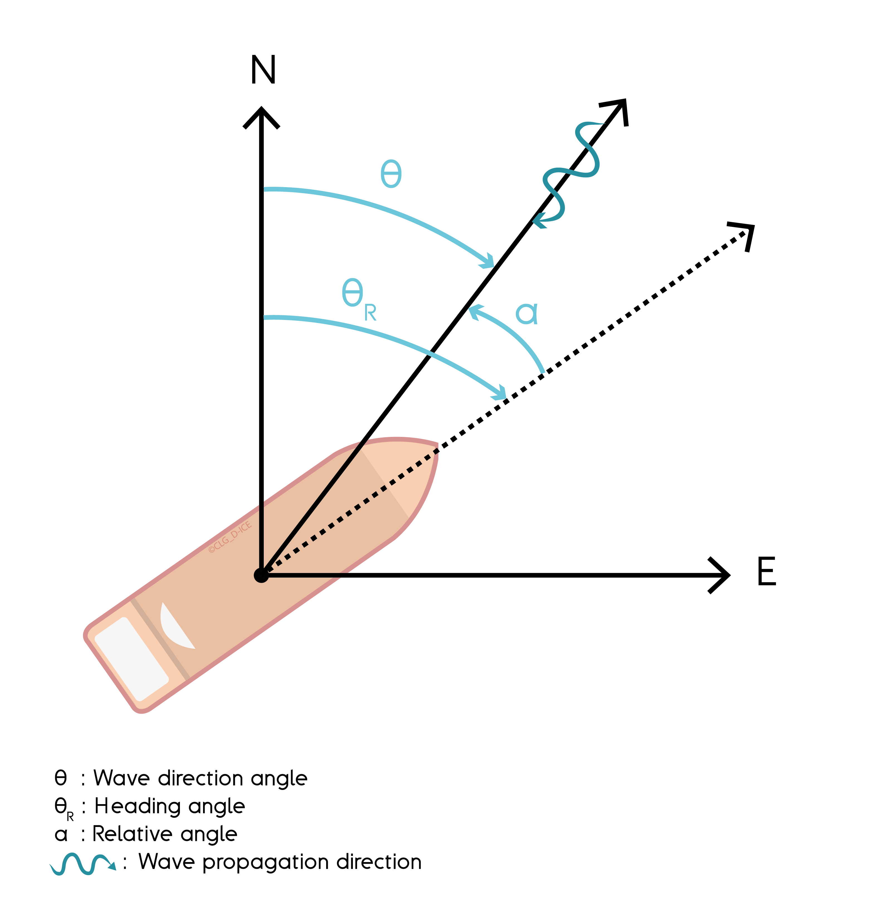

.. _wave_drift:

Mean wave drift force
---------------------

The generalized mean wave drift force, given by the linear approximation, is:

.. math::
    \mathbf{f}_{WD} = 2 \int_0^{2\pi} \int_0^{\infty} S(\omega,\theta) \mathbf{C}(\omega_e,\alpha) d\omega d\theta

where

- :math:`S(\omega,\theta)` is the :any:`wave spectrum amplitude <wave_spectra>`  for the circular frequency :math:`\omega`, and wave direction :math:`\theta`;
- :math:`\omega_e` is the encounter wave frequency, which depends on :math:`\omega`, :math:`\theta` and the constant speed of the vessel :math:`\mathbf{U}`;

.. math::
    \omega_e = \omega - k_{\omega} \mathbf{U} \cdot x_w

where :math:`k_{\omega}` is the wave number and :math:`x_w` is the wave direction of the corresponding wave component.

- :math:`\alpha` is the relative angle between the wave direction and vessel heading, with respect to the :any:`equilibrium frame <equilibrium_frame>`;

    Representation of the wave directions and vessel orientation used for wave drift force computation.

- :math:`\mathbf{C}(\omega_e,\alpha)` are the polar wave drift coefficients, in :math:`N/m^2` which depend on :math:`\omega_e` and :math:`\alpha)`.

