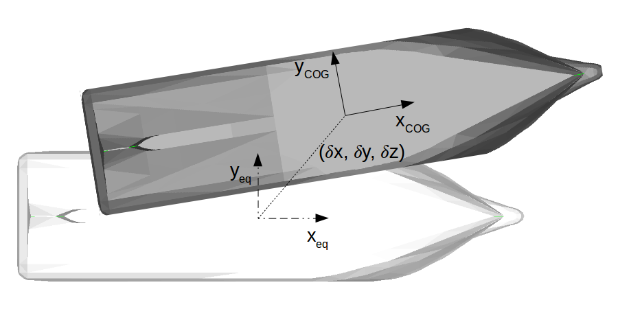

.. _body:

Bodies
======

Bodies are basic object within FRyDoM framework, on which can be applied body components :

- forces,
- links and motors,
- cables,
- collisions box, etc.

Frames of reference
-------------------

..    définition des repères utilisés pour un corps.

Several frames of references can be used when referring to bodies.

.. _fig_reference_frames:

    Representation of the body reference frame (white) and COG reference frame (grey)

Body reference frame
~~~~~~~~~~~~~~~~~~~~

The body reference plane locates the body relatively to the :any:`world reference frame <frame>`. Its origin is defined arbitrary by
the user: it can be located at the bow on the keel, at the center of gravity, etc. Its orientation gives the direction of
the degrees of freedom:

- surge and roll are respectively the translation and rotation related to the x axis of the reference frame,
- sway and pitch are respectively the translation and rotation related to the y axis of the reference frame,
- heave and yaw are respectively the translation and rotation related to the z axis of the reference frame.

All body components (nodes, links, forces) are then set up, relatively to this reference frame.

The accessors and mutators  (GetPointPositionInBody, SetGeneralizedVelocityInBody, TranslateInBody, etc.) which name
contain "InBody", refer to this body reference frame.

The body reference frame is the instantaneous reference frame of the body, which means it follows the body in its motions
and rotations.

COG reference frame
~~~~~~~~~~~~~~~~~~~

The COG reference frame is usually based on a similar orientation as the body reference frame, but its origin is located
at the body center of gravity (COG). Most forces are applied on the COG reference frame.

Mass and inertia
----------------

All bodies must contain mass and inertial quantities (mass :math:`m`, inertia matrix :math:`\mathbf{I}_G`, expressed
on a point :math:`G`); all three can be grouped in an inertia tensor :math:`\mathbb{I}` :

.. math::
    \mathbb{I} = \Biggl \lbrace { m \atop \mathbf{I}_G } \Biggr \rbrace_G

The inertia matrix of a body depends on the choice of the reference point. The generalized Huygens theorem can be used to
express the inertia matrix on an other point:

.. math::
    \mathbf{I}_O = \mathbf{I}_G + \mathbf{I}(m,\mathbf{OG})

where, for :math:`\mathbf{OG} = \begin{bmatrix} a \\ b \\ c \end{bmatrix}`:

.. math::
    \mathbf{I}(m,\mathbf{OG}) = m \begin{bmatrix} b^2 + c^2 & -ab & -ac\\ -ab & a^2 + c^2 & -bc \\ -ac & -bc & a^2 + b^2 \end{bmatrix}

