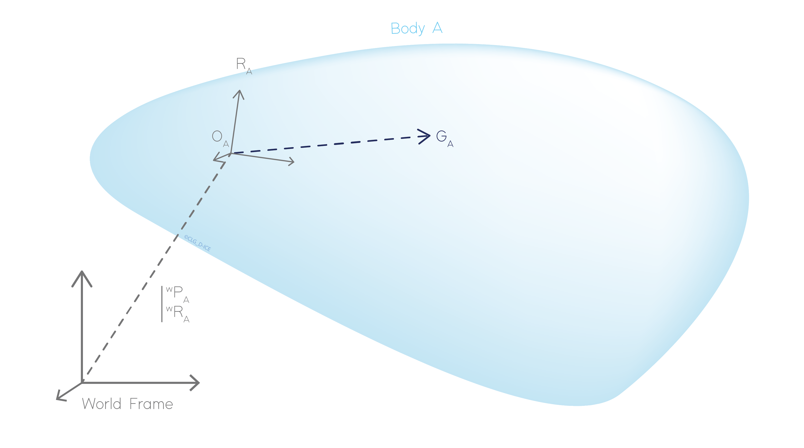

.. _body:

Bodies
======

Bodies are basic object affected by a mass repartition and inertia properties. The position and rotation of the body are represented by a body reference frame fixed to the body. Various external constrains can be applied to a body such as external forces, cable link, motor, body constraints...

Position of the Center of Gravity (COG)
---------------------------------------

Position of the center of gravity is defined in body local coordinate system respect to the body frame of reference.

.. _body_COG:

    Representation of the Center of Gravity position (COG)

External forces and inertia properties can be set directly at the COG position or at arbitrary position. In this last case, transport formula are used to explain such quantities at COG.

Mass and inertia
----------------

The mass :math:`m` and inertial quantities :math:`\mathbf{I}_G` of the body are defined with a inertia tensor at COG :math:`G`.

.. math::
    \mathbb{I} = \Biggl \lbrace { m \atop \mathbf{I}_G } \Biggr \rbrace_G

In case the inertia matrix is not defined at COG but in an other point :math:`M` of the body, the generalized Huygens theorem is used to
express the inertia matrix on an other point:

.. math::
    \mathbf{I}_M = \mathbf{I}_G + \mathbf{I}(m,\mathbf{MG})

with:

.. math::
    \mathbf{I}(m,\mathbf{MG}) = m \begin{bmatrix} b^2 + c^2 & -ab & -ac\\ -ab & a^2 + c^2 & -bc \\ -ac & -bc & a^2 + b^2 \end{bmatrix}

where :math:`\mathbf{MG} = [a, b, c]`.

External forces
---------------

The external forces represent the force and moment applied on the body. They can be applied at any arbitrary point :math:`P` on the body. It's convenient to represent the force and moment by a force tensor :

.. math::
    \lbrace \mathcal{T} \rbrace = \Biggl \lbrace { \mathbf{F} \atop \mathbf{M}_P } \Biggr \rbrace_P

where :math:`\mathbf{F}` and :math:`\mathbf{M}_P` are respectively the force and moment applied on the body at :math:`P`.

To compute the equivalent force tensor at COG, the transport equation is applied on the moment as follows :

.. math::
    \lbrace \mathcal{T} \rbrace = \Biggl \lbrace { \mathbf{F} \atop \mathbf{M}_P + \mathbf{GP} \wedge \mathbf{F} } \Biggr \rbrace_G

Degrees of freedom (DOFMask)
----------------------------

By default every bodies are free to move in the six degrees of freedom, corresponding to the three translations and three rotations. However, some degrees of freedom of the bodies can be fixed by the user in the world reference frame. This is done by adding constraints on the different degrees of freedom. The six degrees of freedom are still considered in the dynamic solver but fixed by constraints.

Node
----

The nodes are specific frames, added to the body and fixed in the body reference frame. Their position and rotation are defined in the body coordinate system which remain fixed during the simulation. They can be used to add :any:`links <link>`, :any:`cable <line_theory>` or :any:`motors <motor>` to the body at a specific position. Also, they can be used to monitor a specific position on the body.

Like a frame transformation and rotation can be applied to a node.

