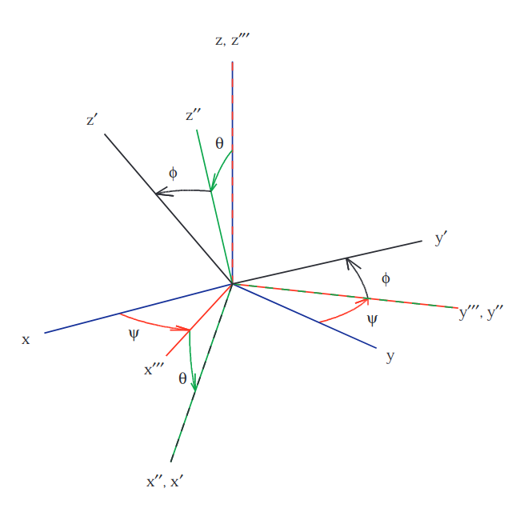

.. _frame:

Frames
======

Definitions
-----------

A frame is defined with an origin position :math:`\mathbf{P}` and three unit axes in three dimensions
(:math:`\mathbf{e}_1`, :math:`\mathbf{e}_2` and :math:`\mathbf{e}_3`) corresponding to a system of coordinates.

.. math::
    \mathcal{F} = \Biggl \lbrace { \mathbf{P} \atop \begin{bmatrix} \mathbf{e}_1 & \mathbf{e}_2 & \mathbf{e}_3 \end{bmatrix} } \Biggr \rbrace

.. note::
    A frame can also be considered as a transformation function from a parent frame, with a translation vector and a rotation
    matrix. Note that a frame has no reference to its parent frame, even if it is constructed based on this parent frame.
    The frame hierarchy co-exists with its associated item hierarchy :
    system (world reference frame) --> body (body reference frame) --> node (node reference frame) for example.

.. note::
    By default, a local frame has no parent and depends on the object to which it is associated. When a frame is applied to a body its parent is the world reference frame whereas when a frame is applied to a :any:`node <node>` (links, cables,...) its parent is the body frame of reference.

World reference frame
~~~~~~~~~~~~~~~~~~~~~

The world reference frame (Oxyz) is the arbitrary frame of reference of the simulation. Its geographic origin can be set up,
however it's orientation is mostly defined : the x-axis is always pointing North.

The two available :any:`frame conventions <conventions>` are indeed :

- North-West-Up (NWU) with z-axis pointing upward,
- North-East-Down (NED) with z-axis pointing downward.

Body reference frame
~~~~~~~~~~~~~~~~~~~~

The body reference plane locates the body relatively to the :any:`world reference frame <frame>`. Its origin is defined arbitrary by
the user: it can be located at the bow, on the keel, at the center of gravity, etc. Its orientation gives the direction of
the degrees of freedom:

- surge and roll are respectively the translation and rotation related to the x axis of the reference frame,
- sway and pitch are respectively the translation and rotation related to the y axis of the reference frame,
- heave and yaw are respectively the translation and rotation related to the z axis of the reference frame.

All body components (nodes, links, forces) are then set up, relatively to this reference frame.

Rotation
--------

The direction of a frame can be associated to a rotation, corresponding to the rotation applied to the parent frame to obtain the current frame. This rotation is represented by unit quaternion in FRyDoM to avoid gimbal lock. However, for better convenience, the rotation can be set up with Euler or Cardan angles as exposed in the following.

Euler angles
~~~~~~~~~~~~

The Euler angles are a combination of three rotation angles used to represent any rotation or the orientation of a frame
relatively to another. These angles are elemental rotations around the axis of a frame of reference. They are usually
called :math:`(\phi,\theta,\psi)` but different sequences exists.

Cardan angles
~~~~~~~~~~~~~

.. Euler Angle Sequence (1,2,3)

The Cardan angles are denoted as yaw, pitch and roll, and correspond to the Euler sequence (1,2,3).
It consists of three consecutive rotations (:numref:`fig_Cardan_angles`) :

- first rotation of an angle :math:`\psi` around the z-axis,
- second rotation of an angle :math:`\theta` around the y''' axis,
- third rotation of an angle :math:`phi` around the x'' axis.

.. _fig_Cardan_angles:

    Representation of the Cardan angles, from Diebel [DIEBEL]_

The body reference frame's x-axis is defined toward the front of the body for both NED and NWU :any:`frame convention <conventions>`.
However in NED the y-axis is along the starboard (with the z-axis pointing downward) while, in NWU, the y-axis is along to the port (with the z-axis pointing upward). The direct implications on rotation is that a positive change in :math:`\theta` corresponds to a pitching downward in the NWU convention, and a pitching upward in the NED convention.

For more information on rotation matrix, and function that pass Cardan angles to their corresponding unit quaternion,
please refer to Diebel [DIEBEL]_.

.. todo: .. images: _static/frame_definition.png

.. In order to have a fully explicit frame notation, we need to specify the parent frame. We then chose the following notation: :math:`^j\mathbb{F}_i` corresponds to the frame :math:`i`, expressed in the frame :math:`j`. It can also represent the frame transformation from frame :math:`i` to frame :math:`j`. In the same manner, :math:`^iv_j` is the velocity of frame :math:`i`, expressed in :math:`j`. It can be expressed in

References

.. [DIEBEL] Diebel, J., Representing Attitude: Euler Angles, Unit Quaternions, and Rotation Vectors, 2006, Standford University, https://www.astro.rug.nl/software/kapteyn/_downloads/attitude.pdf
