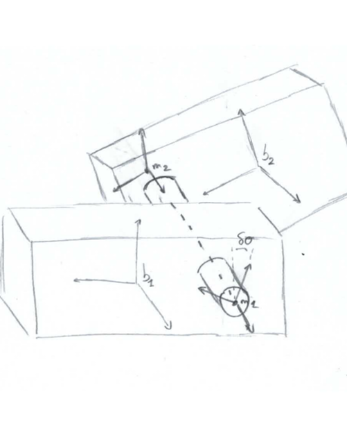
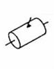
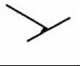
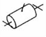
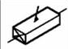
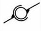
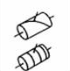

.. _links:

Kinematic links
===============

Kinematic links are used to restrain the relative motion of a body with respect to another body or ground. The links are
defined using nodes attached to the two bodies.

    Representation of a cylindrical link between two bodies.

In the previous figure, :math:`b_1` and :math:`b2` are respectively the reference frame of the first and second body, :math:`m_1` and :math:`m_2` are the node position to which the link is applied.

Various kinematic links are implemented in FRyDoM (see next table)

=============================== =========================== ==============================
Name                            Symbol                      Degrees of freedom
=============================== =========================== ==============================
Cylindrical                          |cylindrical|          1 translation, 1 rotation
Fixed                                |fixe|                 0 translation, 0 rotation
Revolute                             |revolute|             0 translation, 1 rotation
Prismatic                            |prismatic|            1 translation, 0 rotation
Spherical                            |spherical|            0 translation, 3 rotations
Screew                               |screew|               1 translation, 1 rotation
=============================== =========================== ==============================

Motions are constrained with respect to the :math:`x` , :math:`y` and :math:`z` of the first body. The constraints and
joints are thus applied along the axes of the first body.

Spring-damping force
--------------------

A spring-damping force can be applied on the degree of freedom of the revolute and prismatic links, i.e. on the translation
for the prismatic link and around the rotation for the revolute link. This force takes the following form :

.. math::
    \mathbf{F} = - K ( \delta x - r_0 ) - B \dot{\delta x}

with

- :math:`K` the stiffness matrix,
- :math:`B` the damping coefficient
- :math:`\delta x` the relative position of the second body with respect to the first body
- :math:`\dot{ \delta x}` the relative velocity of the second body with respect to the first body
- :math:`r_0` the rest length

.. note::
    This force is applied positively on the second body, and negatively on the first body.