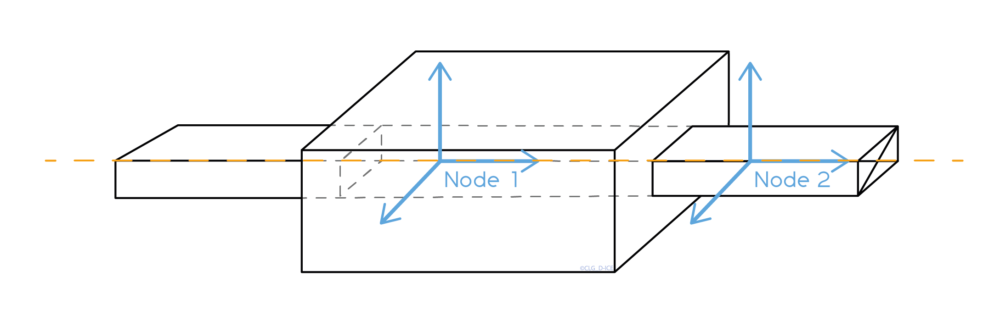

.. _links:

Links
=====

The links are used to restrain the relative motion of a body with respect to another body or ground. This last body is called the master body. The links are applied on nodes attached to the two different bodies.

    Representation of a cylindrical link between two bodies.

In the previous figure, :math:`b_1` and :math:`b2` are respectively the reference frame of the master and second body, :math:`m_1` and :math:`m_2` are the node position to which the link is applied.

Various links are implemented in FRyDoM (see next table)

=============================== =========================== ==============================
Name                            Symbol                      Degrees of freedom
=============================== =========================== ==============================
Cylindrical                          |cylindrical|          1 translation, 1 rotation
Fixed                                |fixe|                 0 translation, 0 rotation
Revolute                             |revolute|             0 translation, 1 rotation
Prismatic                            |prismatic|            1 translation, 0 rotation
Spherical                            |spherical|            0 translation, 3 rotations
Screew                               |screew|               1 translation, 1 rotation
=============================== =========================== ==============================

Motion is constrained with respect to the :math:`x` , :math:`y` and :math:`z` of the master body. The constraints and joints are thus applied along the axes of the master body.

Spring-damping force
--------------------

A spring-damping force can be applied on the degree of freedom of the cylindrical and prismatic links, i.e. on the translation for the prismatic link and around the rotation for the cylindrical force. This force takes the following form :

.. math::
    \mathbf{F} = - K ( \delta x - r_0 ) - B \dot{\delta x}

with

- :math:`K` the stiffness matrix,
- :math:`B` the damping coefficient
- :math:`\delta x` the relative position of the "second" body with respect to the master body
- :math:`\dot{ \delta x}` the relative velocity of the "second" body with respect to the master body
- :math:`r_0` the rest length

This force is applied on the "second" body with respect to the master body.