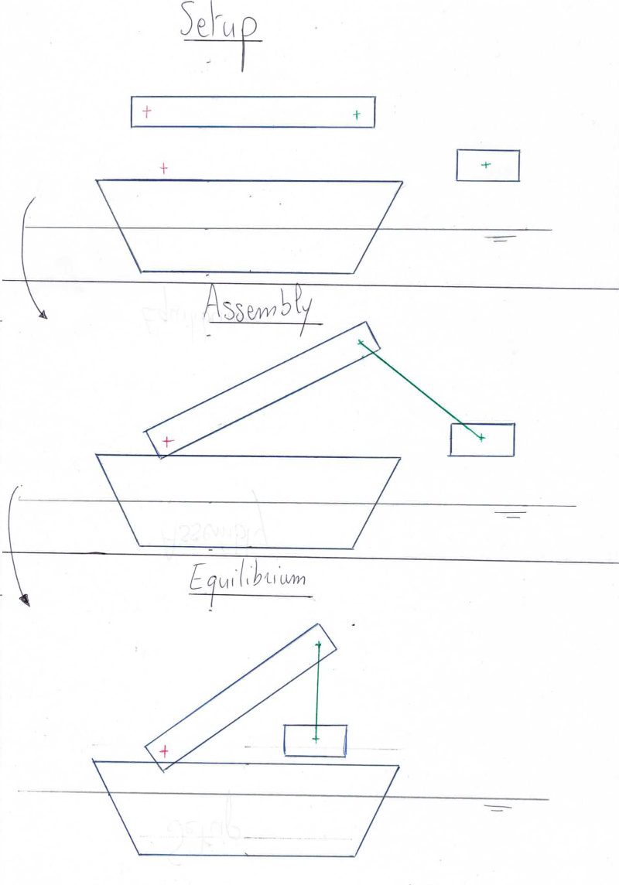

.. static_analysis:

Static analysis
===============

Purpose and method
------------------

The static analysis is designed to help find the static equilibrium of any assembly that can be defined in FRyDoM. It takes
into account all elements that do not provide energy to the system : bodies, links (with no motorization), catenary lines, etc.

.. warning::
    Almost all model forces are not included in the static analysis, including the hydrodynamic forces (radiation damping also).
    Only the :any:`hydrostatic forces<hydrostatics>` and the :any:`damping forces<other_damping>` are taken into account.

The static equilibrium is solved using a dynamic simulation with relaxation of the system, regularly applied. The relaxation
consists in setting to null the velocity and/or acceleration of the bodies.

.. note::
    The assembly of body linked is not solved in this analysis, but is done during the initialisation of the system, as a
    prerequisite of any static or dynamic simulation. This means that the positions of the elements of the system do not
    need to be setup as already linked.

.. _assembly_equilibrium:

    Representation of the elements at setup, after the assembly and after the static analysis.

..
    You can setup them close to their supposed
    equilibrium position, and the static analysis will position them for you. The same goes for the assembly of linked bodies,
    they do not need to be setup as already linked; the assembly is automatically solved.

Tolerance criteria
------------------

A tolerance criteria for the static equilibrium is defined as

.. math::
    \epsilon = \sum_{bodies} |\mathbf{v}|

where :math:`\mathbf{v}` is the velocity of a body. If this criteria is below a user specified tolerance, the equilibrium
is supposed to be reached and the static solving stops.

